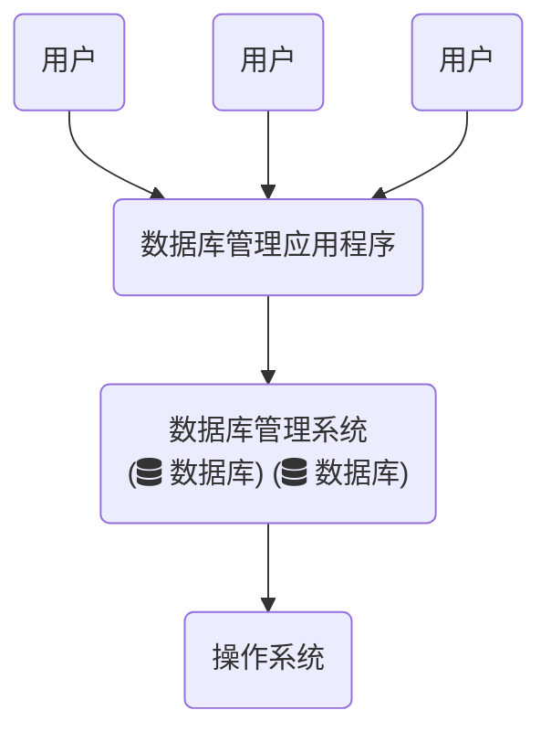

# 入门-数据库与数据表的操作

## 数据库入门

### 数据库基本知识

#### 数据库概述

1. 数据结构化：最重要的特征。数据不是面向某个应用，而是面向全组织；
2. 数据共享：减少数据冗余，避免数据不一致；
3. 数据独立：分为**逻辑独立**与**物理独立**两点；
4. 数据统一管控：安全控制、完整控制、并发控制。


#### 数据库存储结构

数据库并不直接存储数据，而是将数据存储在“表（table）”中。在存储数据的过程中会用到数据库服务器。一个数据库服务器可以管理多个数据库，通常情况下，开发人员会为每个应用创建一个数据库，并在每个数据库中创建多个表。

#### SQL语言

SQL（Structured Query Language,结构化查询语言）：

1. DDL数据定义语言（Data Definition Language,DDL）定义数据库与表等。含CREATE,ALTER,DROP; 
2. DML数据操作语言（Data Manipulation Language,DML）对数据库进行增修删操作。含INSERT,UPDATE,DELETE; 
3. DQL数据查询语言（Data Query Language,DQL）用于查询数据。即SELECT语句; 
4. DCL数据控制语言（Data Control Language,DCL）用于控制用户访问权限。含GRANT,REVOKE,COMMIT,ROLLBACK。

#### 常见数据库产品

1. Oracle：Oracle公司，有良好的兼容性、可移植性和可连接性；
2. SQL Server：Microsoft，提供对XML、Internet标准的支持，只能运行在Windows平台上；
3. DB2：IBM，适合海量数据操作，较为复杂；
4. MongoDB：10gen，开源，介于关系型与非关系型数据库之间，数据结构松散，类似JSON的bjson格式，适合大数据量、高并发、弱事务关系的互联网应用；
5. MySQL：现属于Oracle，开源，跨平台，免费轻量；

### MySQL的安装与配置

#### Windows下

1. 下载.zip/.msi文件
2. 安装
3. bin目录下MySQLInstanceConfig.exe启动配置向导；
   1. Developer Machine（默认）：消耗内存资源最少；
   2. Server Machine：占用内存较多，适合服务器；
   3. Dedicated MySQL Server Machine：MySQL专用服务器，占用所有可能的内存资源。
4. 设置数据库的用途：
   1. Multifunctional Database：平均使用InnoDB与MyISAM储存引擎；
   2. Transactional Database：多使用InnoDB储存引擎，适合事务型应用；
   3. Non-Transcational Database Only：完全禁用InnoDB储存引擎。
5. 设置最大并发量：
   1. Decision Support\(DDS\)/OLAP：决策支持型，较少的并发连接；
   2. Online Transcation Processing\(OLTP\)：联机事务处理型，最大连接数为500；
   3. Manual Setting：手动设置，默认为15.
6. 默认端口号：3306；

#### Linux平台下安装MySQL

1. yum安装；
2. 启动服务：`service mysql start|stop|restart|status`；
3. 设置登录密码：`mysql_secure_installation`;
4. 登陆：`mysql -uroot -p`;
5. 查看数据库验证安装成功与否：`show databases;`

### MySQL目录结构

1. bin/：放置可执行文件（mysql\|mysqld\|mysqlshow.exe等）；
2. data/：放置日志及数据库；
3. include/：放置一些头文件；
4. lib/：放置一系列库文件；
5. share/：放置字符集、语言等；
6. my.ini：配置文件；
7. my-small\|medium\|large\|huge.ini：小\|中\|大\|超大型数据库的配置文件；
8. my-template.ini：配置文件模板；
9. my-innodb-heavy-4G.ini：只对InnobDB存储引擎有效，且服务器内存不能小于4G.。

   _注：如果没有特殊需求，只需配置mysql.ini_

### MySQL的使用

#### 启动MySQL服务

1. 通过windows服务管理器启动；
2. 通过DOS命令启动`net start|restart|stop mysql`；

#### 登陆MySQL数据库

1. 命令登陆：`mysql -h hostname -u username -p`（本地登录可以省略主机名）；
2. MySQL Command Line Client登陆。

#### MySQL的相关命令

| 命令 | 简写 | 含义 |
| :--- | :--- | :--- |
| ？ | \？ | 帮助信息 |
| clear | \c | 明确当前输入语句 |
| connect | \r | 连接到服务器（数据库+主机） |
| delimiter | \d | 设置语句分隔符 |
| ego | \G | 发送命令到MySQL服务器并显示结果 |
| exit | \q |  |
| go | \g | 发送命令到MySQL服务器 |
| help | \h |  |
| notee | \t | 不写输出文件 |
| print | \p | 打印当前命令 |
| prompt | \R | 改变MySQL的提示信息 |
| quit | \q |  |
| rehash | \# | 重建完成散列 |
| source | . | 执行一个SQL脚本文件，以文件名为参数 |
| status | \s |  |
| tee | \T | 设置输出文件，并将信息添加到所有给定的输出文件 |
| use | \u | 使用数据库 |
| charset | \C | 切换字符集 |
| warings | \W | 每个语句后显示警告 |
| nowarnings | \w | 每个语句后不显示警告 |

####  重新配置MySQL

1. DOS命令：`set character_set_client=gbk;`\(只对当前窗口有效\)
2. 配置my.ini文件：`default-character-set=utf8`

## 数据库和表的基本操作

### 数据库基础知识

#### 创建和查看数据库

```sql
CREATE DATABASES dbName;
SHOW DATABASES;
SHOW CREATE DATABASE dbName;
```

#### 修改数据库

```sql
ALTER DATABASE dbName DEFAULT CHARACTER SET code COLLATE code_bin
-- eg.
alter database test default character set gbk collate gbk_bin;
```

#### 删除数据库

```sql
DROP DATABASE dbName;
```

### 数据类型

#### 整数类型

| 数据类型 | 字节数 | 无符号数取值 | 有符号数取值 |
| :--- | :--- | :--- | :--- |
| TINYINT | 1 | 0~255 | -128~127 |
| SMALLINT | 2 | 0~65535 | -32768~32767 |
| MEDIUMINT | 3 | 0~16777215 | -8388608~8388607 |
| INT | 4 | 0~4294967295 | -2147483648~2147483647 |
| BIGINT | 8 | 0~18446744073709511615 | -9223372036854775808~9223372036854775807 |

#### 浮点/定点数类型

| 数据类型 | 字节数 | 有符号的取值范围 | 无符号的取值范围 |
| :--- | :--- | :--- | :--- |
| FLOAT | 4 | -3.402823466E+38~-1.175494351E-38 | 0和-1.175494351E-38~3.402823466E+38 |
| DOUBLE | 8 | -1.7976931348623157E+308~2.2250738585072014E-308 | 0和2.2250738585072014E-308~1.7976931348623157E+308 |
| DECIMAL\(M,D\) | M+2 | -1.7976931348623157E+308~2.2250738585072014E-308 | 0和2.2250738585072014E-308~1.7976931348623157E+308 |

_注：DECIMAL类型与DOUBLE类型取值范围相同，前者有效长度由M、D决定。其中M是数据长度，D是小数点后的位数。_

#### 日期与时间类型

| 数据类型 | 字节数 | 取值范围 | 显示格式 | 零值 |
| :--- | :--- | :--- | :--- | :--- |
| YEAR | 1 | 1901~2155 | YYYY | 0000 |
| DATE | 4 | 1000-01-01~9999-12-31 | YYYY-MM-DD |  |
| TIME | 3 | -838:59:59~838:59:59 | HH:MM:SS | 00:00:00 |
| DATETIME | 8 | 1000-01-01 00:00:00~9999-12-31 23:59:59 | YYYY-MM-DD HH:MM:SS | 0000-00-00 00:00:00 |
| TIMESTAMP | 4 | 1970-01-01 00:00:01~2038-01-19 03:14:07 | YYYY-MM-DD HH:MM:SS | 0000-00-00 00:00:00 |

_注意：若插入数据不合法，系统会将对应零值放入数据库_

1. YEAR：可以用四位字符串或数字输入，也可以用两位字符串或数字输入。其中'00'~'69'为2000~2069，'70'~'99'为1970~1999.**注意区分：字符'0'代表2000，数字0代表0000**；
2. DATE：字符串输入为'YYYY-MM-DD'或'YYYYMMDD'或'YY-MM-DD'或'YYMMDD'，数字表示为YY-MM-DD或YYMMDD；
3. TIME：字符串输入为'D HH:MM:SS'或'HHMMSS'其中D取值0~34。实际插入数据的小时值为（D\*24+HH）；数字表示为HHSSMM；
4. DATETIME：字符串输入为'YYYY-MM-DD HH:MM:SS'或'YYYYMMDDHHMMSS'，数字输入为YYYYMMDDHHMMSS。其中的YYYY也可以用YY表示，方法同于YEAR的表示方法；
5. TIMESTAMP：显示格式同DATETIME，取值范围较小。在输入NULL或无输入时，系统会输入当前日期与时间。

_示例：_

```sql
mysql> select now(),current_date(),current_time(),curdate(),curtime(),date(now());
```

now()|current_date()|current_time()|current_timestamp|curdate()|curtime()|date(now()) 
---|---|---|---|---|---|--- |
2019-01-03 20:01:36 | 2019-01-03|20:01:36 |2019-01-03 20:01:36 | 2019-01-03 | 20:01:36 | 2019-01-03

#### 字符串和二进制类型

| 数据类型 | 类型说明 |
| :--- | :--- |
| CHAR | 固定长度的字符串 |
| VARCHAR | 可变长度的字符串 |
| BINARY | 固定长度的二进制数据 |
| VARBINARY | 可变长度的二进制数据 |
| BOLB | 二进制大数据 |
| TEXT | 大文本数据 |
| ENUM | 枚举类型，只能存储一个枚举字符串值 |
| SET | 字符串对象，可以由零个或多个值 |
| BIT | 位字段类型 |

1. CHAR和VARCHAR：`CHAR(M)或VARCHAR(M)`M表示最大长度。其中前者长度固定，后者实际大小为为存入字符串字节数+1；
2. BINARY和VARBINARY：`BINARY(M)或VARBINARY(M)`M表示最大字节长度。注意前者会将不满最大长度的数据的后面用'\0'（null）补齐；
3. TEXT：用于表示大文本数据，如文章、评论等。具体分为四种：

| TINYTEXT | TEXT | MEDIUMTEXT | LONGTEXT |
| :--- | :--- | :--- | :--- |
| 0~255B | 0~65535B | 0~16777215B | 0~4294967295B |

1. BLOB\(Binary Large Object\)：表示数据量很大的二进制数据，如图片、PDF文档等。具体分为四种：

| TINYBLOB | BLOB | MEDIUMBLOB | LONGBLOB |
| :--- | :--- | :--- | :--- |
| 0~255B | 0~65535B | 0~16777215B | 0~4294967295B |

_注：TEXT与BLOB主要区别只在于，前者进行比较和排序时根据文本，后者根据二进制编码。_

1. ENUM：`ENUM ('value 1' ,'value 2',...,'value n')`需要注意的是，MySQL中存入枚举列表里的是每个值的顺序编号，而不是这个值本身；
2. SET：`SET ('value 1' ,'value 2',...,'value n')`SET的储存原理与ENUM类似，列表中每个值都有一个顺序编号，但SET专门表示字符串对象；
3. BIT：`BIT(M)`表示二进制数据。M表示每个值的位数，范围是1~64.注意如果存入数据的长度小于M，会将数据的左边用0补齐。

### 数据表的基本操作

#### 创建数据表

首先要用`USE dbName`选择一个数据库，否则会发生“No database selected”错误。

```sql
CREATE TABLE tableName
(
    字段名1 数据类型[完整性约束条件],
    字段名2 数据类型[完整性约束条件],
    ...
    字段名n 数据类型[完整性约束条件],
)
```

#### 查看数据表

```sql
-- 1.查看数据库中的表
SHOW TABLES;

-- 2.查看表的编码、字段信息、索引以及存储引擎。
SHOW CREATE TABLE tableName;

-- 3.查看表的字段信息
DESCRIBE tableName;
#or
DESC tableName;
```

#### 修改数据表

在MySQL中，修改数据表的操作都是使用`ALTER TABLE`语句。具体如下：

```sql
-- 1.修改表名
ALTER TABLE oldTableName RENAME [TO] newTableName;

-- 2.修改字段名
ALTER TABLE tableName CHANGE oldColumnName newColumnName newDataType;

-- 3.修改字段类型
ALTER TABLE tableName MODIFY columnName datatype;

-- 4.添加字段
ALTER TABLE tableName ADD newColumnName dataType
    [约束条件][FIRST|AFTER columnName]

-- 5.删除字段
ALTER TABLE tableName DROP columnName;

-- 6.修改字段位置
ALTER TABLE tableName MODIFY columnName1 dataType FIRST|AFTER columnName2；
```

#### 删除数据表

```sql
DROP TABLE tableName;
```

_注：这种删除方法一般用于删除与其他表没有关联的表_

### 表的约束

常见的有：

| 约束条件 | 说明 |
| :--- | :--- |
| PRIMARY KEY | 主键约束，用于唯一标识对应的记录 |
| FOREIGN KEY | 外键约束 |
| NOT NULL | 非空约束 |
| UNIQUE | 唯一性约束 |
| DEFAULT | 默认值约束，用于设置字段的默认值 |

其中FOREIGN KEY约束条件涉及多表操作。

#### 主键约束

```sql
-- 1.单字段主键
columnName dataType PRIMARY KEY;

-- 2.多字段主键
PRIMARY KEY(columnName_1,columnName_2,...,columnName_n);
```

_注：每个数据表最多有一个主键约束，定义为PRIMARY KEY的字段不能有重复值也不能为空_

#### 非空约束

```sql
columnName dataType NOT NULL;
```

#### 唯一约束

```sql
columnName dataType UNIQUE;
```

#### 默认约束

```sql
columnName dataType DEFAULT defaultValue;
```

### 设置表的字段值自动增加

其约束的字段可以是任何整数类型，默认从1开始增加。

```sql
columnName dataType AUTO_INCREMENT;
```

### 索引

#### 索引的概念

1. 普通索引：由KEY或INDEX定义，适用于任何数据类型；
2. 唯一性索引：由UNIQUE定义的索引，该索引所在字段的值必须唯一；
3. 全文索引：由FULLTEXT定义的索引，只支持CHAR,VARCHAR,TEXT类型的字段。另外目前只有MyISAM存储引擎支持全文索引；
4. 单列索引：指单个字端上创造的索引，可以是普通索引、唯一索引或全文索引；
5. 多列索引：表中多个字段上建立的索引，只有在查询条件中使用了这些字段中的第一个字段时，该索引才会被使用；
6. 空间索引：由SPATIAL定义的索引，只能创建在空间数据类型的字段上，分别有：GEOMETRY,POINT,LINESTRING和POLYGON。注意，创建空间索引的字段还得声明NOT NULL，并且使用MyISAM存储引擎。

#### 创建索引

```sql
-- 1.创建表时直接创建索引
CREATE TABLE(
cloumnName dataType[完整约束条件],
cloumnName dataType[完整约束条件],
...
    [UNIQUE|FULLTEXT|SPATIAL] INDEX|KEY
    [别名](columnName1 [(length)] [ASC|DESC])
)
/*******************
1. UNIQUE|FULLTEXT|SPATIAL：唯一索引|全文索引|空间索引，若空缺则为普通索引；
2. INDEX|KEY：二者选一即可；
3. 别名：可选参数，表示创建的索引的名称；
4. columnName1：指定索引对应字段的名称；
5. length：可选，用于表示索引的长度；
6. ASC|DESC：可选，前者为升序排列，后者为降序排列。
*******************/

-- 2.使用CREATE INDEX在已有表上创建索引
CREATE [UNIQUE|FULLTEXT|SPATIAL] INDEX indexName ON tableName (columnName [(length)] [ASC|DESC]);

-- 3. 使用ALTER TABLE在已有表上创建索引
ALTER TABLE tableName ADD [UNIQUE|FULLTEXT|SPATIAL] INDEX indexName (columnName [(length)] [ASC|DESC]);
```

#### 删除索引

```sql
-- 1. 使用ALTER TABLE删除索引
ALTER TABLE tableName DROP INDEX indexName;

-- 2. 使用DROP INDEX删除索引
DROP INDEX indexName ON tableName;
```
