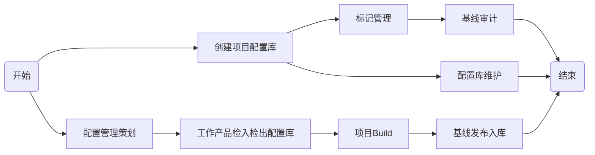

# Firefly

## Inspur

### 配置管理

* 开发人员安装：Firefly Client
* 集中式、分布式配置工具
  * FireFly：功能较强，操作方便，目前在公司应用于JAVA平台、DotNet
  * TFS(Team Foundation Server):TFS与.NET集成好，新版本对常见IDE都能很好的集成，同时支持git模式

### Firefly介绍

Hansky公司的软件配置管理系统Firefly是Hansky软件开发管理套件中的重要组件。使用Firefly可以轻松管理、维护整个企业的整个软件资产，包括程序代码和相关文档。Firefly是一个功能完善、运行速度极快的软件配置管理系统，可以支持不同的操作系统和多种集成开发环境，因此它能在整个企业中的不同团队，不同项目中都得以广泛应用。

Firefly基于真正的客户机/服务器体系结构，不依赖于任何特殊的网络文件系统，可以平滑地运行在不同的LAN、WAN环境中。它的安装配置过程简单易用，开发团队可以快速掌握Firefly的使用技巧，立即进入高效率的工作状态。Firefly可以自动、安全地保存代码的每一次变化内容，避免代码被无意地覆盖、修改。 项目管理人员使用Firefly可以有效地组织开发力量进行并行开发和管理项目中各阶段点的各种资源，使得产品发布易于管理；并可以快速地回溯到任一历史版本。系统管理员使用Firefly的内置工具可以方便的进行存储库的备份和恢复，而不依赖于任何第三方工具。

## Firefly配置管理

### firefly配置管理

配置管理过程是整个软件生存期中实施管理和技术规程的过程，它标识、定义系统中软件项，并制定基线；控制软件项的修改和发行；记录和报告软件项的状态和修改申请；保证软件项的完整性、协调性和正确性；以及控制软件项的储存、装载和交付。

### 软件配置管理基本概念

* 基线：基线是一组经正式审查和批准的工作产品，是未来工作的基础，需要经由变更控制流程才能改变。
  * 基线是一个相对稳定的逻辑实体，其中的配置项不能再被任何人随意修改。
  * 基线是开发过程中的里程碑，一个产品可以有多个，也可以只有一个基线。
  * 通常将交付给客户的基线版本称为一个“Release”。
* 配置库：指配置管理系统在存储库中创建的逻辑数据库，开发人员连接配置库对库中的配置项进行配置管理
* 工作区: 开发工程师工作的配置管理下的目录区域
  * 日常各项配置管理操作多在工作区进行，例如查看配置项版本、历史，检出、修改、检入、删除、配置项受控、版本比较等。
  * 个人工作区隔离而不孤立的，工作中是通过配置服务器和项目组其他人员工作区保持联系。
  * 个人工作区工作质量直接影响配置库中受控配置项的质量。
* 产品库：软件研发结束后,发布的软件产品(文档与安装程序) 存放的位置。

### 项目配置管理流程

**主要活动：**

1. 项目配置管理策划
   * 项目配置管理员与项目软件经理一起识别配置项，编制项目配置管理计划。
2. 项目配置库创建
   * 项目配置管理员填写提交《项目配置库申请单》申请项目配置库。
   * 公司配置主管依据申请单及《公司配置管理规范》创建、初始项目配置库。
3. 项目配置库管理
   * 项目组人员按规范使用配置管理工具操作配置库，及时将项目工作产品放配置库管理。
   * 项目配置管理员定期进行配置管理审计。
   * 公司配置管理员定期对开发库、基线库进行备份。
4. 基线管理
   * 基线建立
     * 项目配置管理员依据项目配置管理计划，对特定的配置项进行标记，创建项目基线。主要基线有：需求、设计、数据结构基线和发布的源码基线。
     * 基线打完以后项目配置管理员发送邮件，通知项目组及相关成员了解。
   * 基线变更
     * 项目组填写《基线变更申请单》，提交给项目软件经理。
     * 项目软件经理组织召开CCB评审会进行评审。
     * 项目根据评审结果进行修改。保证已修改的配置项不会造成未料到的影响。
     * 项目配置管理员对变更的的基线建立新的基线并通知相关组和人员。
5. 基线审计
   * 在项目基线建立后，项目配置管理员根据项目配置管理计划进行基线审计，并编制发送基线审计报告

### Firefly配置管理工具使用

#### 基本操作

1. 初始化（新建）工作区
   1. 用户登录
   2. 选择项目
   3. 选择分支
   4. 选择本地目录
   5. 初始完成
2. Bringover工作区
3. 工作区设置要求
   * firefly-ip：10.110.3.29
   * 端口：4759（不使用SSL）
4. 工作区管理
   1. 新建
   2. 编辑
   3. 删除
   4. 导入
   5. 卸载

#### 文件操作

文件变更操作，遵循的规范过程：**检出—变更—检入**，主要操作：***修改***、***新增***、*删除*、*重命名*、*移动*、*回滚*

* 蓝色：已修改
* 红色：已删除
* 绿色：新增加

1. 修改：
2. 新增：添加新文件到配置管理
   1. 选中私有文件或目录
   2. Add to Source Control（添加到版本控制）
   3. 确认添加选项
   4. 提交完成
3. 版本历史
   1. 记录文件的真实演变过程
   2. 记录完整的文件版本信息从1.0开始，自动生成版本号
   3. 保留冲突合并的记录
   4. 比较版本

删除、重命名、移动等操作比较复杂，不建议新员工做，后期慢慢学习，这里先不介绍

### Firefly-Web

* 不用安装本地程序，使用浏览器即可方便登录配置库。
* 根据设定的权限实现各部门对配置库源码及文档进行方便共享。
* 快捷方便的对放入配置库的源码和文档进行浏览查看、代码复查、代码评审、下载文档、版本比较及对产品和项目工作产品提交情况进行监督检查。

* 配置库数据查阅地址： [http://10.110.3.29:8081](http://10.110.3.29:8081)
* 个人账号属性设置： [http://10.110.3.29:8082](http://10.110.3.29:8082)

## 参考资源

[firefly配置管理](res/firefly.pdf)
