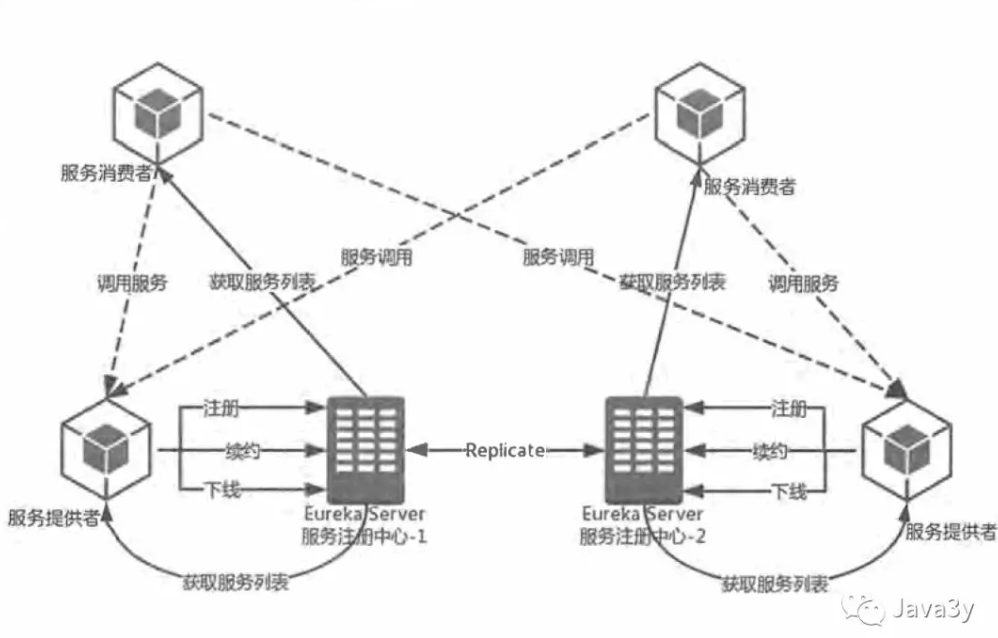
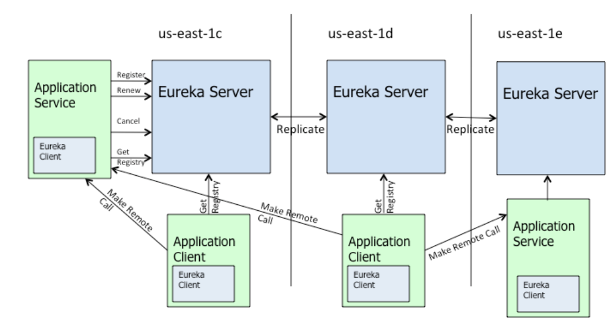
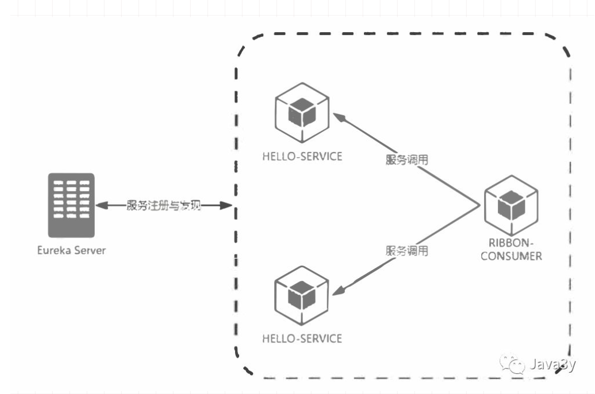
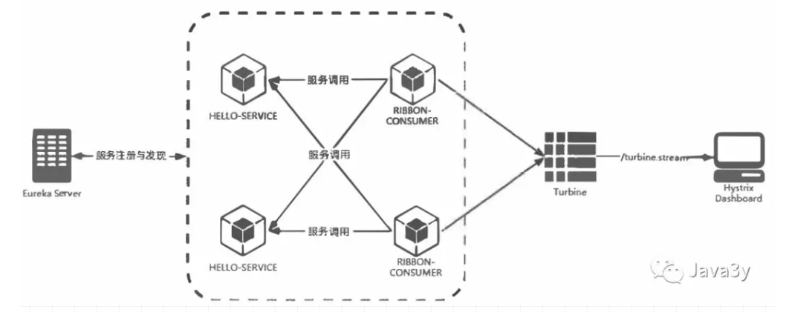
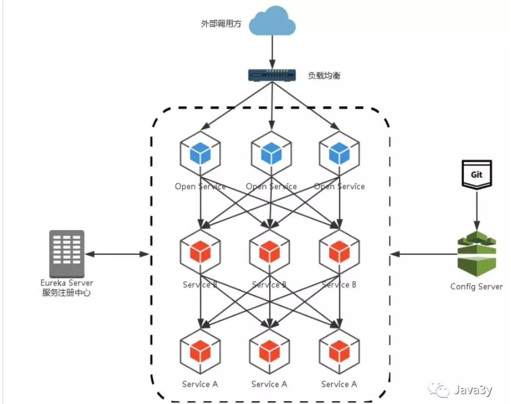

# SpringCoud 快速上手

参考：[https://mp.weixin.qq.com/s?__biz=MzI4Njg5MDA5NA==&mid=2247484335&idx=1&sn=a871bf871fcaffda0be40e1388a69d7d&scene=21#wechat_redirect](https://mp.weixin.qq.com/s?__biz=MzI4Njg5MDA5NA==&mid=2247484335&idx=1&sn=a871bf871fcaffda0be40e1388a69d7d&scene=21#wechat_redirect)

## 基础概念

* SpringCloud的基础功能：
	* 服务治理： Spring  Cloud Eureka
	* 客户端负载均衡： Spring Cloud Ribbon
	* 服务容错保护： Spring  Cloud Hystrix 
	* 声明式服务调用： Spring  Cloud Feign
	* API网关服务：Spring Cloud Zuul
	* 分布式配置中心： Spring Cloud Config
* SpringCloud的高级功能：
	* 消息总线： Spring  Cloud Bus
	* 消息驱动的微服务： Spring Cloud Stream
	* 分布式服务跟踪： Spring  Cloud Sleuth


## 服务发现组件 Netflix Eureka

首当其冲的就是子系统之间的通讯问题。子系统与子系统之间不是在同一个环境下，那就需要远程调用。远程调用可能就会想到httpClient，WebService等等这些技术来实现。

既然是远程调用，就必须知道ip地址，我们可能有以下的场景。

* 功能实现一：A服务需要调用B服务
	* 在A服务的代码里面调用B服务，显式通过IP地址调用：`http://123.123.123.123:8888/java3y/3`
* 功能实现二：A服务调用B服务，B服务调用C服务，C服务调用D服务

	* 在A服务的代码里面调用B服务，显式通过IP地址调用：`http://123.123.123.123:8888/java3y/3`，(同样地)B->C，C->D
* 功能实现三：D服务调用B服务，B服务调用C服务

	* 在D服务的代码里面调用B服务，显式通过IP地址调用：`http://123.123.123.123:8888/java3y/3`，(同样地)B->C
* …..等等等等


万一，我们B服务的IP地址变了，想想会出现什么问题：A服务,D服务(等等)需要手动更新B服务的地址

为了解决微服务架构中的服务实例维护问题(ip地址)， 产生了大量的服务治理框架和产品。 这些框架和产品的实现都围绕着服务注册与服务发现机制来完成对微服务应用实例的自动化管理。

Eureka是这样解决上面所说的情况的：

* 创建一个E服务，将A、B、C、D四个服务的信息都注册到E服务上，E服务维护这些已经注册进来的信息
* A、B、C、D四个服务都可以拿到Eureka(服务E)那份注册清单。A、B、C、D四个服务互相调用不再通过具体的IP地址，而是通过服务名来调用！

Eureka专门用于给其他服务注册的称为Eureka Server(服务注册中心)，其余注册到Eureka Server的服务称为Eureka Client。

在Eureka Server一般我们会这样配置：

```
register-with-eureka: false     #false表示不向注册中心注册自己。
fetch-registry: false     #false表示自己端就是注册中心，我的职责就是维护服务实例，并不需要去检索服务
```

Eureka Client分为服务提供者和服务消费者。但很可能，某服务既是服务提供者又是服务消费者。如果在网上看到SpringCloud的某个服务配置没有"注册"到Eureka-Server也不用过于惊讶——但是它是可以获取Eureka服务清单的。很可能只是作者把该服务认作为单纯的服务消费者，单纯的服务消费者无需对外提供服务，也就无须注册到Eureka中了

```yml
eureka:
  client:
    register-with-eureka: false  # 当前微服务不注册到eureka中(消费端)
    service-url:
      defaultZone: http://eureka7001.com:7001/eureka/,http://eureka7002.com:7002/eureka/,http://eureka7003.com:7003/eureka/  
```

下面是Eureka的治理机制：

* 服务提供者
	* 服务注册：启动的时候会通过发送REST请求的方式将自己注册到Eureka Server上，同时带上了自身服务的一些元数据信息
	* 服务续约：在注册完服务之后，服务提供者会维护一个心跳用来持续告诉Eureka Server:  "我还活着 ” 
	* 服务下线：当服务实例进行正常的关闭操作时，它会触发一个服务下线的REST请求给Eureka Server, 告诉服务注册中心：“我要下线了 ”。
* 服务消费者
	* 获取服务：当我们启动服务消费者的时候，它会发送一个REST请求给服务注册中心，来获取上面注册的服务清单
	* 服务调用：服务消费者在获取服务清单后，通过服务名可以获得具体提供服务的实例名和该实例的元数据信息。在进行服务调用的时候，优先访问同处一个Zone中的服务提供方。
* Eureka Server(服务注册中心)：
	* 失效剔除：默认每隔一段时间（默认为60秒） 将当前清单中超时（默认为90秒）没有续约的服务剔除出去。
	* 自我保护：。EurekaServer 在运行期间，会统计心跳失败的比例在15分钟之内是否低于85%(通常由于网络不稳定导致)。 Eureka Server会将当前的实例注册信息保护起来， 让这些实例不会过期，尽可能保护这些注册信息。



调用关系说明：

1. 服务提供者在启动时，向注册中心注册自己提供的服务。
2. 服务消费者在启动时，向注册中心订阅自己所需的服务。
3. 注册中心返回服务提供者地址给消费者。
4. 服务消费者从提供者地址中调用消费者。

### 如何使用 Eureka 进行服务注册和发现

參考文章： [https://zhuanlan.zhihu.com/p/26472547](https://zhuanlan.zhihu.com/p/26472547)



1、服务端添加依赖

```xml
<dependency>
         <groupId>org.springframework.cloud</groupId>
         <artifactId>spring-cloud-starter-eureka-server</artifactId>
</dependency>
```

2、服务端添加配置

```properties
# server (eureka 默认端口为：8761)
server.port=8761
# spring
spring.application.name=spring-cloud-server
# eureka
# 是否注册到eureka
eureka.client.register-with-eureka=false
# 是否从eureka获取注册信息
eureka.client.fetch-registry=false
# eureka服务器的地址（注意：地址最后面的 /eureka/ 这个是固定值）
eureka.client.serviceUrl.defaultZone=http://localhost:${server.port}/eureka/
```

3、服务端添加注解

```java
@EnableEurekaServer
```

4、客户端添加依赖

```xml
<dependency>
      <groupId>org.springframework.cloud</groupId>
      <artifactId>spring-cloud-starter-eureka</artifactId>
</dependency>
```

5、客户端添加配置

```properties
提供者
# server
server.port=7777
# spring
spring.application.name=spring-cloud-provider
# eureka
eureka.client.serviceUrl.defaultZone=http://localhost:8761/eureka/
消费者
# server
server.port=8888
# spring
spring.application.name=spring-cloud-consumer
# eureka
eureka.client.serviceUrl.defaultZone=http://localhost:8761/eureka/
```

6、客户端添加注解

```java
@EnableEurekaClient
```

>注意：EMERGENCY! EUREKA MAY BE INCORRECTLY CLAIMING INSTANCES ARE UP WHEN THEY'RE NOT. RENEWALS ARE LESSER THAN THRESHOLD AND HENCE THE INSTANCES ARE NOT BEING EXPIRED JUST TO BE SAFE.
>
>分析：是由于Eureka进入了保护模式。在保护模式下，Eureka Server将会尝试保护其服务注册表中的信息，暂时不会注销服务注册表中的服务。


## 負載均衡 Ribbon

负载均衡区分了两种类型：

* 客户端负载均衡(Ribbon)
	* 服务实例的清单在客户端，客户端进行负载均衡算法分配。
	* (从上面的知识我们已经知道了：客户端可以从Eureka Server中得到一份服务清单，在发送请求时通过负载均衡算法，在多个服务器之间选择一个进行访问)
* 服务端负载均衡(Nginx)
	* 服务实例的清单在服务端，服务器进行负载均衡算法分配



Ribbon是支持负载均衡，默认的负载均衡策略是轮询，我们也是可以根据自己实际的需求自定义负载均衡策略的。

```java
@Configuration
public class MySelfRule
{
    @Bean
    public IRule myRule()
    {
        //return new RandomRule();// Ribbon默认是轮询，我自定义为随机
        //return new RoundRobinRule();// Ribbon默认是轮询，我自定义为随机
        return new RandomRule_ZY();// 我自定义为每台机器5次
    }
}
```

实现起来也很简单：继承AbstractLoadBalancerRule类，重写public Server choose(ILoadBalancer lb, Object key)即可。

## 熔断 Hystrix

在高并发的情况下，由于单个服务的延迟，可能导致所有的请求都处于延迟状态，甚至在几秒钟就使服务处于负载饱和的状态，资源耗尽，直到不可用，最终导致这个分布式系统都不可用，这就是“雪崩”。

针对上述问题， Spring Cloud Hystrix实现了断路器、线程隔离等一系列服务保护功能。

* Fallback(失败快速返回)：当某个服务单元发生故障（类似用电器发生短路）之后，通过断路器的故障监控（类似熔断保险丝）， 向调用方返回一个错误响应， 而不是长时间的等待。这样就不会使得线程因调用故障服务被长时间占用不释放，避免了故障在分布式系统中的蔓延。
* 资源/依赖隔离(线程池隔离)：它会为每一个依赖服务创建一个独立的线程池，这样就算某个依赖服务出现延迟过高的情况，也只是对该依赖服务的调用产生影响， 而不会拖慢其他的依赖服务。


Hystrix提供几个熔断关键参数：滑动窗口大小（20）、 熔断器开关间隔（5s）、错误率（50%）

* 每当20个请求中，有50%失败时，熔断器就会打开，此时再调用此服务，将会直接返回失败，不再调远程服务。
* 直到5s钟之后，重新检测该触发条件，判断是否把熔断器关闭，或者继续打开。

Hystrix还有请求合并、请求缓存这样强大的功能，在此我就不具体说明了，有兴趣的同学可继续深入学习~

### Hystrix仪表盘

它主要用来实时监控Hystrix的各项指标信息。通过Hystrix Dashboard反馈的实时信息，可以帮助我们快速发现系统中存在的问题，从而及时地采取应对措施。

除了可以开启单个实例的监控页面之外，还有一个监控端点 /turbine.stream是对集群使用的。 从端点的命名中，可以引入Turbine, 通过它来汇集监控信息，并将聚合后的信息提供给 HystrixDashboard 来集中展示和监控。



## Feign

上面已经介绍了Ribbon和Hystrix了，可以发现的是：他俩作为基础工具类框架广泛地应用在各个微服务的实现中。我们会发现对这两个框架的使用几乎是同时出现的。

为了简化我们的开发，Spring Cloud Feign出现了！它基于 Netflix Feign 实现，整合了 Spring Cloud Ribbon 与 Spring Cloud Hystrix,  除了整合这两者的强大功能之外，它还提供了声明式的服务调用(不再通过RestTemplate)。

Feign是一种声明式、模板化的HTTP客户端。在Spring Cloud中使用Feign, 我们可以做到使用HTTP请求远程服务时能与调用本地方法一样的编码体验，开发者完全感知不到这是远程方法，更感知不到这是个HTTP请求。

下面就简单看看Feign是怎么优雅地实现远程调用的：

服务绑定：

```java
// value --->指定调用哪个服务
// fallbackFactory--->熔断器的降级提示
@FeignClient(value = "MICROSERVICECLOUD-DEPT", fallbackFactory = DeptClientServiceFallbackFactory.class)
public interface DeptClientService {
    // 采用Feign我们可以使用SpringMVC的注解来对服务进行绑定！
    @RequestMapping(value = "/dept/get/{id}", method = RequestMethod.GET)
    public Dept get(@PathVariable("id") long id);
    @RequestMapping(value = "/dept/list", method = RequestMethod.GET)
    public List<Dept> list();
    @RequestMapping(value = "/dept/add", method = RequestMethod.POST)
    public boolean add(Dept dept);
}
```

Feign中使用熔断器：

```java
/**
* Feign中使用断路器
* 这里主要是处理异常出错的情况(降级/熔断时服务不可用，fallback就会找到这里来)
*/
@Component // 不要忘记添加，不要忘记添加
public class DeptClientServiceFallbackFactory implements FallbackFactory<DeptClientService> {
    @Override
    public DeptClientService create(Throwable throwable) {
        return new DeptClientService() {
            @Override
            public Dept get(long id) {
                return new Dept().setDeptno(id).setDname("该ID：" + id + "没有没有对应的信息,Consumer客户端提供的降级信息,此刻服务Provider已经关闭")
                        .setDb_source("no this database in MySQL");
            }
            @Override
            public List<Dept> list() {
                return null;
            }
            @Override
            public boolean add(Dept dept) {
                return false;
            }
        };
    }
}
```

## API 网关 Zuul

基于上面的学习，我们现在的架构很可能会设计成这样：



这样的架构会有两个比较麻烦的问题：

1. 路由规则与服务实例的维护间题：外层的负载均衡(nginx)需要维护所有的服务实例清单(图上的OpenService)
2. 签名校验、 登录校验冗余问题：为了保证对外服务的安全性， 我们在服务端实现的微服务接口，往往都会有一定的权限校验机制，但我们的服务是独立的，我们不得不在这些应用中都实现这样一套校验逻辑，这就会造成校验逻辑的冗余。

每个服务都有自己的IP地址，Nginx想要正确请求转发到服务上，就必须维护着每个服务实例的地址！更是灾难的是：这些服务实例的IP地址还有可能会变，服务之间的划分也很可能会变。

购物车和订单模块都需要用户登录了才可以正常访问，基于现在的架构，只能在购物车和订单模块都编写校验逻辑，这无疑是冗余的代码。

为了解决上面这些常见的架构问题，API网关的概念应运而生。在SpringCloud中了提供了基于Netflix Zuul实现的API网关组件Spring Cloud Zuul。

Spring Cloud Zuul是这样解决上述两个问题的：

* SpringCloud Zuul通过与SpringCloud Eureka进行整合，将自身注册为Eureka服务治理下的应用，同时从Eureka中获得了所有其他微服务的实例信息。外层调用都必须通过API网关，使得将维护服务实例的工作交给了服务治理框架自动完成。
* 在API网关服务上进行统一调用来对微服务接口做前置过滤，以实现对微服务接口的拦截和校验。

Zuul天生就拥有线程隔离和断路器的自我保护功能，以及对服务调用的客户端负载均衡功能。也就是说：Zuul也是支持Hystrix和Ribbon。

关于Zuul还有很多知识点(由于篇幅问题，这里我就不细说了)：

* 路由匹配(动态路由)
* 过滤器实现(动态过滤器)
* 默认会过滤掉Cookie与敏感的HTTP头信息(额外配置)


Zuul支持Ribbon和Hystrix，也能够实现客户端的负载均衡。我们的Feign不也是实现客户端的负载均衡和Hystrix的吗？既然Zuul已经能够实现了，那我们的Feign还有必要吗？

或者可以这样理解：
* zuul是对外暴露的唯一接口相当于路由的是controller的请求，而Ribbonhe和Fegin路由了service的请求
* zuul做最外层请求的负载均衡 ，而Ribbon和Fegin做的是系统内部各个微服务的service的调用的负载均衡

有了Zuul，还需要Nginx吗？他俩可以一起使用吗？
* 我的理解：Zuul和Nginx是可以一起使用的(毕竟我们的Zuul也是可以搭成集群来实现高可用的)，要不要一起使用得看架构的复杂度了(业务)

## SpringCloud Config

Spring Cloud Config项目是一个解决分布式系统的配置管理方案。它包含了Client和Server两个部分，server提供配置文件的存储、以接口的形式将配置文件的内容提供出去，client通过接口获取数据、并依据此数据初始化自己的应用。

* 简单来说，使用Spring Cloud Config就是将配置文件放到统一的位置管理(比如GitHub)，客户端通过接口去获取这些配置文件。
* 在GitHub上修改了某个配置文件，应用加载的就是修改后的配置文件。

SpringCloud Config其他的知识：

* 在SpringCloud Config的服务端， 对于配置仓库的默认实现采用了Git，我们也可以配置SVN。
* 配置文件内的信息加密和解密
* 修改了配置文件，希望不用重启来动态刷新配置，配合Spring  Cloud Bus 使用~

bootstrap.yml（bootstrap.properties）与application.yml（application.properties）执行顺序

参考： https://www.cnblogs.com/BlogNetSpace/p/8469033.html

* bootstrap.yml（bootstrap.properties）用来在程序引导时执行，应用于更加早期配置信息读取，如可以使用来配置application.yml中使用到参数等
* application.yml（application.properties) 应用程序特有配置信息，可以用来配置后续各个模块中需使用的公共参数等。
* bootstrap.yml 先于 application.yml 加载

典型的应用场景如下：当使用 Spring Cloud Config Server 的时候，你应该在 bootstrap.yml 里面指定 spring.application.name 和 spring.cloud.config.server.git.uri 和一些加密/解密的信息。技术上，bootstrap.yml 是被一个父级的 Spring ApplicationContext 加载的。这个父级的 Spring ApplicationContext是先加载的，在加载application.yml 的 ApplicationContext之前。

为何需要把 config server 的信息放在 bootstrap.yml 里？当使用 Spring Cloud 的时候，配置信息一般是从 config server 加载的，为了取得配置信息（比如密码等），你需要一些提早的引导配置。因此，把 config server 信息放在 bootstrap.yml，用来加载在这个时期真正需要的配置信息。


