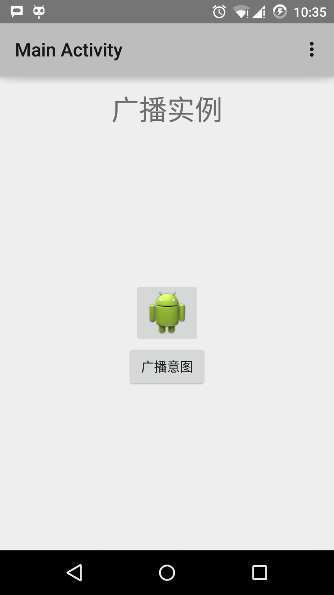
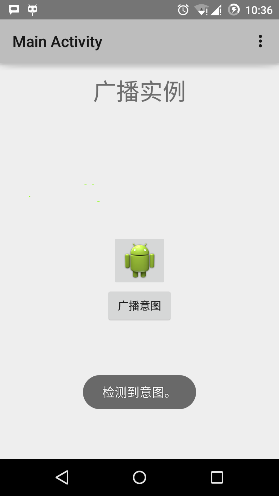

# Android 广播接收器(Broadcast Receivers)

- [参考资源](https://www.runoob.com/android/android-broadcast-receivers.html)

广播接收器用于响应来自其他应用程序或者系统的广播消息。这些消息有时被称为事件或者意图。例如，应用程序可以初始化广播来让其他的应用程序知道一些数据已经被下载到设备，并可以为他们所用。这样广播接收器可以定义适当的动作来拦截这些通信。

有以下两个重要的步骤来使系统的广播意图配合广播接收器工作。

- 创建广播接收器
- 注册广播接收器

还有一个附加的步骤，要实现自定义的意图，你必须创建并广播这些意图。

## 创建广播接收器

广播接收器需要实现为BroadcastReceiver类的子类，并重写onReceive()方法来接收以Intent对象为参数的消息。

```java
public class MyReceiver extends BroadcastReceiver {
   @Override
   public void onReceive(Context context, Intent intent) {
      Toast.makeText(context, "Intent Detected.", Toast.LENGTH_LONG).show();
   }
}
```

## 注册广播接收器

应用程序通过在AndroidManifest.xml中注册广播接收器来监听制定的广播意图。假设我们将要注册MyReceiver来监听系统产生的ACTION_BOOT_COMPLETED事件。该事件由Android系统的启动进程完成时发出。


```xml
<application
   android:icon="@drawable/ic_launcher"
   android:label="@string/app_name"
   android:theme="@style/AppTheme" >
   <receiver android:name="MyReceiver">

      <intent-filter>
         <action android:name="android.intent.action.BOOT_COMPLETED">
         </action>
      </intent-filter>

   </receiver>
</application>
```

现在，无论什么时候Android设备被启动，都将被广播接收器MyReceiver所拦截，并且在onReceive()中实现的逻辑将被执行。

有许多系统产生的事件被定义为类Intent中的静态常量值。下面的表格列举了重要的系统事件。

事件常量	|描述
---|---
android.intent.action.BATTERY_CHANGED	|持久的广播，包含电池的充电状态，级别和其他信息。
android.intent.action.BATTERY_LOW	|标识设备的低电量条件。
android.intent.action.BATTERY_OKAY	|标识电池在电量低之后，现在已经好了。
android.intent.action.BOOT_COMPLETED	|在系统完成启动后广播一次。
android.intent.action.BUG_REPORT	|显示报告bug的活动。
android.intent.action.CALL	|执行呼叫数据指定的某人。
android.intent.action.CALL_BUTTON	|用户点击"呼叫"按钮打开拨号器或者其他拨号的合适界面。
android.intent.action.DATE_CHANGED	|日期发生改变。
android.intent.action.REBOOT	|设备重启。

## 广播自定义意图

如果你想要应用程序中生成并发送自定义意图，你需要在活动类中通过sendBroadcast()来创建并发送这些意图。如果你使用sendStickyBroadcast(Intent)方法，则意图是持久的(sticky)，这意味者你发出的意图在广播完成后一直保持着。

```
public void broadcastIntent(View view)
{
   Intent intent = new Intent();
   intent.setAction("com.runoob.CUSTOM_INTENT");
   sendBroadcast(intent);
}
```

com.runoob.CUSTOM_INTENT的意图可以像之前我们注册系统产生的意图一样被注册。

```java
<application
   android:icon="@drawable/ic_launcher"
   android:label="@string/app_name"
   android:theme="@style/AppTheme" >
   <receiver android:name="MyReceiver">

      <intent-filter>
         <action android:name="com.runoob.CUSTOM_INTENT">
         </action>
      </intent-filter>

   </receiver>
</application>
```

## 实例

这个实例将解释如何创建广播接收器来拦截自定义意图。一旦你熟悉自定义意图，你可以为应用程序编程来拦截系统产生的意图。让我们按照下面的步骤来修改Hello World实例章节中我们创建的Android应用程序。

1. 使用Android Studio来创建Android应用程序并命名为broadcastreceiver，并放在Hello World实例章节中的com.runoob.broadcastreceiver包下。
2. 修改主要活动文件MainActivity.java来添加broadcastIntent()方法。
3. 在com.runoob.broadcastreceiver包下创建名为MyReceiver.java的新的Java文件来定义广播接收器。
4. 应用程序可以处理一个或多个自定义或者系统的意图，没有任何限制。每个你想拦截的意图都需要使用<receiver.../>标签在AndroidManifest.xml中注册。
5. 修改res/layout/activity_main.xml文件中的默认内容来包含一个广播意图的按钮。
6. 不需要修改字符串文件，Android Studio会注意string.xml文件。
7. 启动Android模拟器来运行应用程序，并验证应用程序所做改变的结果。
下面是修改的主要活动文件src/com.runoob.broadcastreceiver/MainActivity.java的内容。这个文件包含了每个基础的生命周期方法。我们添加了broadcastIntent()方法来广播自定义事件。

```java
package com.runoob.broadcastreceiver;

import android.os.Bundle;
import android.app.Activity;
import android.view.Menu;
import android.content.Intent;
import android.view.View;

public class MainActivity extends Activity {

    @Override
    public void onCreate(Bundle savedInstanceState) {
        super.onCreate(savedInstanceState);
        setContentView(R.layout.activity_main);
    }

    @Override
    public boolean onCreateOptionsMenu(Menu menu) {
        getMenuInflater().inflate(R.menu.menu_main, menu);
        return true;
    }

    // 广播自定义意图
    public void broadcastIntent(View view){
        Intent intent = new Intent();
        intent.setAction("cn.programmer.CUSTOM_INTENT");
        sendBroadcast(intent);
    }
}
```

下面是src/com.runoob.broadcastreceiver/MyReceiver.java的内容：

```java
package com.runoob.broadcastreceiver;

import android.content.BroadcastReceiver;
import android.content.Context;
import android.content.Intent;
import android.widget.Toast;

public class MyReceiver extends BroadcastReceiver {
    @Override
    public void onReceive(Context context, Intent intent) {
        Toast.makeText(context, "检测到意图。", Toast.LENGTH_LONG).show();
    }
}
```

接下来修改AndroidManifest.xml文件。这里通过添加<receiver.../>标签来包含我们的广播接收器：

```xml
<?xml version="1.0" encoding="utf-8"?>
<manifest xmlns:android="http://schemas.android.com/apk/res/android"
    package="com.runoob.broadcastreceiver"
    android:versionCode="1"
    android:versionName="1.0" >

    <uses-sdk
        android:minSdkVersion="8"
        android:targetSdkVersion="22" />

    <application
        android:icon="@drawable/ic_launcher"
        android:label="@string/app_name"
        android:theme="@style/AppTheme" >

        <activity
            android:name=".MainActivity"
            android:label="@string/title_activity_main" >

            <intent-filter>
                <action android:name="android.intent.action.MAIN" />
                <category android:name="android.intent.category.LAUNCHER"/>
            </intent-filter>

        </activity>

        <receiver android:name="MyReceiver">

            <intent-filter>
                <action android:name="cn.programmer.CUSTOM_INTENT">
                </action>
            </intent-filter>

        </receiver>

    </application>

</manifest>
```

下面是res/layout/activity_main.xml文件的内容，包含广播自定义意图的按钮。

```xml
<RelativeLayout xmlns:android="http://schemas.android.com/apk/res/android"
    xmlns:tools="http://schemas.android.com/tools" android:layout_width="match_parent"
    android:layout_height="match_parent" android:paddingLeft="@dimen/activity_horizontal_margin"
    android:paddingRight="@dimen/activity_horizontal_margin"
    android:paddingTop="@dimen/activity_vertical_margin"
    android:paddingBottom="@dimen/activity_vertical_margin" tools:context=".MainActivity">

    <TextView
        android:id="@+id/textView1"
        android:layout_width="wrap_content"
        android:layout_height="wrap_content"
        android:text="广播实例"
        android:layout_alignParentTop="true"
        android:layout_centerHorizontal="true"
        android:textSize="30dp" />

    <TextView
        android:id="@+id/textView2"
        android:layout_width="wrap_content"
        android:layout_height="wrap_content"
        android:text="www.runoob.com"
        android:textColor="#ff87ff09"
        android:textSize="30dp"
        android:layout_above="@+id/imageButton"
        android:layout_centerHorizontal="true"
        android:layout_marginBottom="40dp" />

    <ImageButton
        android:layout_width="wrap_content"
        android:layout_height="wrap_content"
        android:id="@+id/imageButton"
        android:src="@drawable/ic_launcher"
        android:layout_centerVertical="true"
        android:layout_centerHorizontal="true" />

    <Button
        android:layout_width="wrap_content"
        android:layout_height="wrap_content"
        android:id="@+id/button2"
        android:text="广播意图"
        android:onClick="broadcastIntent"
        android:layout_below="@+id/imageButton"
        android:layout_centerHorizontal="true" />

</RelativeLayout>
```

下面是res/values/strings.xml文件的内容，定义了两个新的常量。

```xml
<?xml version="1.0" encoding="utf-8"?>
<resources>

    <string name="app_name">Android Broadcast Receiver</string>
    <string name="action_settings">Settings</string>
    <string name="menu_settings">Settings</string>
    <string name="title_activity_main">Main Activity</string>

</resources>
```

让我们运行刚刚修改的Hello World!应用程序。我假设你已经在安装环境时创建了AVD。打开你的项目中的活动文件，点击工具栏中的图片图标来在Android Studio中运行应用程序。Android Studio在AVD上安装应用程序并启动它。如果一切顺利，将在模拟器窗口上显示如下：



现在点击"广播意图"按钮来广播我们的自定义意图。这将广播我们的自定义意图"cn.programmer.CUSTOM_INTENT"，在我们注册的广播接收器MyReceiver中拦截并执行我们实现的逻辑。模拟器的底部将出现toast。如下：




你可以尝试实现其他的广播接收器来拦截系统产生的意图，如系统启动，日期改变和低电量等。

