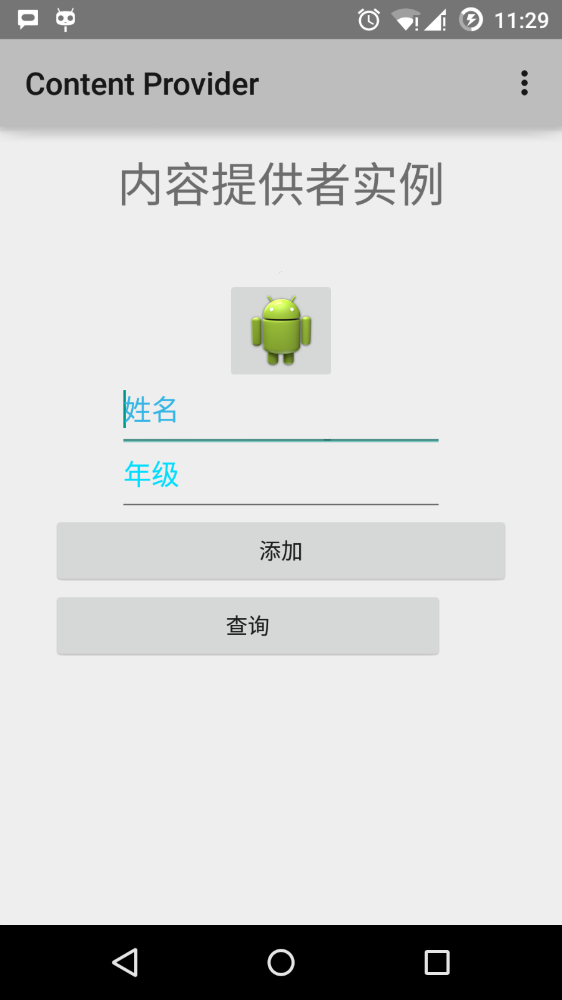
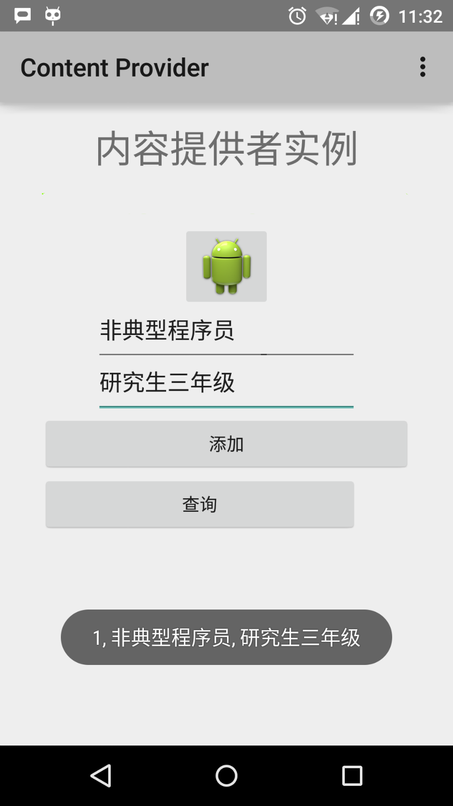

# Android - 内容提供者(Content Provider)

- [参考资源](https://www.runoob.com/android/android-content-providers.html)

内容提供者组件通过请求从一个应用程序向其他的应用程序提供数据。这些请求由类 ContentResolver 的方法来处理。内容提供者可以使用不同的方式来存储数据。数据可以被存放在数据库，文件，甚至是网络。


有时候需要在应用程序之间共享数据。这时内容提供者变得非常有用。

内容提供者可以让内容集中，必要时可以有多个不同的应用程序来访问。内容提供者的行为和数据库很像。你可以查询，编辑它的内容，使用 insert()， update()， delete() 和 query() 来添加或者删除内容。多数情况下数据被存储在 SQLite 数据库。

内容提供者被实现为类 ContentProvider 类的子类。需要实现一系列标准的 API，以便其他的应用程序来执行事务。

```java
public class MyApplication extends  ContentProvider {

}
```

## 内容URI

要查询内容提供者，你需要以如下格式的URI的形式来指定查询字符串：

```xml
<prefix>://<authority>/<data_type>/<id>
```

以下是URI中各部分的具体说明：

部分|	说明
---|---
prefix	|前缀：一直被设置为content://
authority|	授权：指定内容提供者的名称，例如联系人，浏览器等。第三方的内容提供者可以是全名，如：cn.programmer.statusprovider
data_type|	数据类型：这个表明这个特殊的内容提供者中的数据的类型。例如：你要通过内容提供者Contacts来获取所有的通讯录，数据路径是people，那么URI将是下面这样：content://contacts/people
id	|这个指定特定的请求记录。例如：你在内容提供者Contacts中查找联系人的ID号为5，那么URI看起来是这样：content://contacts/people/5

## 创建内容提供者

这里描述创建自己的内容提供者的简单步骤。

1. 首先，你需要继承类 ContentProviderbase 来创建一个内容提供者类。
2. 其次，你需要定义用于访问内容的你的内容提供者URI地址。
3. 接下来，你需要创建数据库来保存内容。通常，Android 使用 SQLite 数据库，并在框架中重写 onCreate() 方法来使用 SQLiteOpenHelper 的方法创建或者打开提供者的数据库。当你的应用程序被启动，它的每个内容提供者的 onCreate() 方法将在应用程序主线程中被调用。
4. 最后，使用<provider.../>标签在 AndroidManifest.xml 中注册内容提供者。

以下是让你的内容提供者正常工作，你需要在类 ContentProvider 中重写的一些方法：


- onCreate():当提供者被启动时调用。
- query():该方法从客户端接受请求。结果是返回指针(Cursor)对象。
- insert():该方法向内容提供者插入新的记录。
- delete():该方法从内容提供者中删除已存在的记录。
- update():该方法更新内容提供者中已存在的记录。
- getType():该方法为给定的URI返回元数据类型。

## 实例

该实例解释如何创建自己的内容提供者。让我们按照下面的步骤：

步骤	描述
1. 使用 Android Studio 创建 Android 应用程序并命名为 Content Provider，在包com.runoob.contentprovider 下，并建立空活动。
2. 修改主要活动文件 MainActivity.java 来添加两个新的方法 onClickAddName() 和 onClickRetrieveStudents()。
3. 在包 com.runoob.contentprovider 下创建新的 Java 文件 StudentsProvider.java 来定义实际的提供者，并关联方法。
4. 使用<provider.../>标签在 AndroidManifest.xml 中注册内容提供者。
5. 修改 res/layout/activity_main.xml 文件的默认内容来包含添加学生记录的简单界面。
6. 无需修改 strings.xml，Android Studio 会注意 strings.xml 文件。
7. 启动 Android 模拟器来运行应用程序，并验证应用程序所做改变的结果。

下面是修改的主要活动文件 src/com.runoob.contentprovider/MainActivity.java 的内容。该文件包含每个基础的生命周期方法。我们添加了两个新的方法，onClickAddName() 和 onClickRetrieveStudents() 来让应用程序处理用户交互。

```java
package com.runoob.contentprovider;

import android.net.Uri;
import android.os.Bundle;
import android.app.Activity;
import android.content.ContentValues;
import android.content.CursorLoader;
import android.database.Cursor;
import android.view.Menu;
import android.view.View;
import android.widget.EditText;
import android.widget.Toast;
import com.runoob.contentprovider.R;

public class MainActivity extends Activity {

    @Override
    protected void onCreate(Bundle savedInstanceState) {
        super.onCreate(savedInstanceState);
        setContentView(R.layout.activity_main);
    }

    @Override
    public boolean onCreateOptionsMenu(Menu menu) {
        getMenuInflater().inflate(R.menu.menu_main, menu);
        return true;
    }

    public void onClickAddName(View view) {
        // Add a new student record
        ContentValues values = new ContentValues();

        values.put(StudentsProvider.NAME,
                ((EditText)findViewById(R.id.editText2)).getText().toString());

        values.put(StudentsProvider.GRADE,
                ((EditText)findViewById(R.id.editText3)).getText().toString());

        Uri uri = getContentResolver().insert(
                StudentsProvider.CONTENT_URI, values);

        Toast.makeText(getBaseContext(),
                uri.toString(), Toast.LENGTH_LONG).show();
    }

    public void onClickRetrieveStudents(View view) {

        // Retrieve student records
        String URL = "content://com.example.provider.College/students";

        Uri students = Uri.parse(URL);
        Cursor c = managedQuery(students, null, null, null, "name");

        if (c.moveToFirst()) {
            do{
                Toast.makeText(this,
                        c.getString(c.getColumnIndex(StudentsProvider._ID)) +
                                ", " +  c.getString(c.getColumnIndex( StudentsProvider.NAME)) +
                                ", " + c.getString(c.getColumnIndex( StudentsProvider.GRADE)),
                        Toast.LENGTH_SHORT).show();
            } while (c.moveToNext());
        }
    }
}
```

在包com.runoob.contentprovider下创建新的文件StudentsProvider.java。以下是src/com.runoob.contentprovider/StudentsProvider.java的内容。

```java
package com.runoob.contentprovider;

import java.util.HashMap;

import android.content.ContentProvider;
import android.content.ContentUris;
import android.content.ContentValues;
import android.content.Context;
import android.content.UriMatcher;

import android.database.Cursor;
import android.database.SQLException;
import android.database.sqlite.SQLiteDatabase;
import android.database.sqlite.SQLiteOpenHelper;
import android.database.sqlite.SQLiteQueryBuilder;

import android.net.Uri;
import android.text.TextUtils;

public class StudentsProvider extends ContentProvider {

    static final String PROVIDER_NAME = "com.example.provider.College";
    static final String URL = "content://" + PROVIDER_NAME + "/students";
    static final Uri CONTENT_URI = Uri.parse(URL);

    static final String _ID = "_id";
    static final String NAME = "name";
    static final String GRADE = "grade";

    private static HashMap<String, String> STUDENTS_PROJECTION_MAP;

    static final int STUDENTS = 1;
    static final int STUDENT_ID = 2;

    static final UriMatcher uriMatcher;
    static{
        uriMatcher = new UriMatcher(UriMatcher.NO_MATCH);
        uriMatcher.addURI(PROVIDER_NAME, "students", STUDENTS);
        uriMatcher.addURI(PROVIDER_NAME, "students/#", STUDENT_ID);
    }

    /**
     * 数据库特定常量声明
     */
    private SQLiteDatabase db;
    static final String DATABASE_NAME = "College";
    static final String STUDENTS_TABLE_NAME = "students";
    static final int DATABASE_VERSION = 1;
    static final String CREATE_DB_TABLE =
            " CREATE TABLE " + STUDENTS_TABLE_NAME +
                    " (_id INTEGER PRIMARY KEY AUTOINCREMENT, " +
                    " name TEXT NOT NULL, " +
                    " grade TEXT NOT NULL);";

    /**
     * 创建和管理提供者内部数据源的帮助类.
     */
    private static class DatabaseHelper extends SQLiteOpenHelper {
        DatabaseHelper(Context context){
            super(context, DATABASE_NAME, null, DATABASE_VERSION);
        }

        @Override
        public void onCreate(SQLiteDatabase db)
        {
            db.execSQL(CREATE_DB_TABLE);
        }

        @Override
        public void onUpgrade(SQLiteDatabase db, int oldVersion, int newVersion) {
            db.execSQL("DROP TABLE IF EXISTS " +  STUDENTS_TABLE_NAME);
            onCreate(db);
        }
    }

    @Override
    public boolean onCreate() {
        Context context = getContext();
        DatabaseHelper dbHelper = new DatabaseHelper(context);

        /**
         * 如果不存在，则创建一个可写的数据库。
         */
        db = dbHelper.getWritableDatabase();
        return (db == null)? false:true;
    }

    @Override
    public Uri insert(Uri uri, ContentValues values) {
        /**
         * 添加新学生记录
         */
        long rowID = db.insert( STUDENTS_TABLE_NAME, "", values);

        /**
         * 如果记录添加成功
         */

        if (rowID > 0)
        {
            Uri _uri = ContentUris.withAppendedId(CONTENT_URI, rowID);
            getContext().getContentResolver().notifyChange(_uri, null);
            return _uri;
        }
        throw new SQLException("Failed to add a record into " + uri);
    }

    @Override
    public Cursor query(Uri uri, String[] projection, String selection,String[] selectionArgs, String sortOrder) {
        SQLiteQueryBuilder qb = new SQLiteQueryBuilder();
        qb.setTables(STUDENTS_TABLE_NAME);

        switch (uriMatcher.match(uri)) {
            case STUDENTS:
                qb.setProjectionMap(STUDENTS_PROJECTION_MAP);
                break;

            case STUDENT_ID:
                qb.appendWhere( _ID + "=" + uri.getPathSegments().get(1));
                break;

            default:
                throw new IllegalArgumentException("Unknown URI " + uri);
        }

        if (sortOrder == null || sortOrder == ""){
            /**
             * 默认按照学生姓名排序
             */
            sortOrder = NAME;
        }
        Cursor c = qb.query(db, projection, selection, selectionArgs,null, null, sortOrder);

        /**
         * 注册内容URI变化的监听器
         */
        c.setNotificationUri(getContext().getContentResolver(), uri);
        return c;
    }

    @Override
    public int delete(Uri uri, String selection, String[] selectionArgs) {
        int count = 0;

        switch (uriMatcher.match(uri)){
            case STUDENTS:
                count = db.delete(STUDENTS_TABLE_NAME, selection, selectionArgs);
                break;

            case STUDENT_ID:
                String id = uri.getPathSegments().get(1);
                count = db.delete( STUDENTS_TABLE_NAME, _ID +  " = " + id +
                        (!TextUtils.isEmpty(selection) ? " AND (" + selection + ')' : ""), selectionArgs);
                break;

            default:
                throw new IllegalArgumentException("Unknown URI " + uri);
        }

        getContext().getContentResolver().notifyChange(uri, null);
        return count;
    }

    @Override
    public int update(Uri uri, ContentValues values, String selection, String[] selectionArgs) {
        int count = 0;

        switch (uriMatcher.match(uri)){
            case STUDENTS:
                count = db.update(STUDENTS_TABLE_NAME, values, selection, selectionArgs);
                break;

            case STUDENT_ID:
                count = db.update(STUDENTS_TABLE_NAME, values, _ID + " = " + uri.getPathSegments().get(1) +
                        (!TextUtils.isEmpty(selection) ? " AND (" +selection + ')' : ""), selectionArgs);
                break;

            default:
                throw new IllegalArgumentException("Unknown URI " + uri );
        }
        getContext().getContentResolver().notifyChange(uri, null);
        return count;
    }

    @Override
    public String getType(Uri uri) {
        switch (uriMatcher.match(uri)){
            /**
             * 获取所有学生记录
             */
            case STUDENTS:
                return "vnd.android.cursor.dir/vnd.example.students";

            /**
             * 获取一个特定的学生
             */
            case STUDENT_ID:
                return "vnd.android.cursor.item/vnd.example.students";

            default:
                throw new IllegalArgumentException("Unsupported URI: " + uri);
        }
    }
}
```

以下是修改后的AndroidManifest.xml文件。这里添加了<provider.../>标签来包含我们的内容提供者：

```xml
<?xml version="1.0" encoding="utf-8"?>
<manifest xmlns:android="http://schemas.android.com/apk/res/android"
    package="com.runoob.contentprovider"
    android:versionCode="1"
    android:versionName="1.0" >

    <uses-sdk
        android:minSdkVersion="8"
        android:targetSdkVersion="22" />

    <application
        android:allowBackup="true"
        android:icon="@drawable/ic_launcher"
        android:label="@string/app_name"
        android:theme="@style/AppTheme" >

        <activity
            android:name="com.runoob.contentprovider.MainActivity"
            android:label="@string/app_name" >

            <intent-filter>
                <action android:name="android.intent.action.MAIN" />
                <category android:name="android.intent.category.LAUNCHER" />
            </intent-filter>

        </activity>

        <provider android:name="StudentsProvider"
            android:authorities="com.example.provider.College" >
        </provider>

    </application>

</manifest>
```

下面是res/layout/activity_main.xml文件的内容：

```xml
<RelativeLayout xmlns:android="http://schemas.android.com/apk/res/android"
    xmlns:tools="http://schemas.android.com/tools" android:layout_width="match_parent"
    android:layout_height="match_parent" android:paddingLeft="@dimen/activity_horizontal_margin"
    android:paddingRight="@dimen/activity_horizontal_margin"
    android:paddingTop="@dimen/activity_vertical_margin"
    android:paddingBottom="@dimen/activity_vertical_margin" tools:context=".MainActivity">

    <TextView
        android:id="@+id/textView1"
        android:layout_width="wrap_content"
        android:layout_height="wrap_content"
        android:text="内容提供者实例"
        android:layout_alignParentTop="true"
        android:layout_centerHorizontal="true"
        android:textSize="30dp" />

    <TextView
        android:id="@+id/textView2"
        android:layout_width="wrap_content"
        android:layout_height="wrap_content"
        android:text="www.runoob.com"
        android:textColor="#ff87ff09"
        android:textSize="30dp"
        android:layout_below="@+id/textView1"
        android:layout_centerHorizontal="true" />

    <ImageButton
        android:layout_width="wrap_content"
        android:layout_height="wrap_content"
        android:id="@+id/imageButton"
        android:src="@drawable/ic_launcher"
        android:layout_below="@+id/textView2"
        android:layout_centerHorizontal="true" />

    <Button
        android:layout_width="wrap_content"
        android:layout_height="wrap_content"
        android:id="@+id/button2"
        android:text="添加"
        android:layout_below="@+id/editText3"
        android:layout_alignRight="@+id/textView2"
        android:layout_alignEnd="@+id/textView2"
        android:layout_alignLeft="@+id/textView2"
        android:layout_alignStart="@+id/textView2"
        android:onClick="onClickAddName"/>

    <EditText
        android:layout_width="wrap_content"
        android:layout_height="wrap_content"
        android:id="@+id/editText"
        android:layout_below="@+id/imageButton"
        android:layout_alignRight="@+id/imageButton"
        android:layout_alignEnd="@+id/imageButton" />

    <EditText
        android:layout_width="wrap_content"
        android:layout_height="wrap_content"
        android:id="@+id/editText2"
        android:layout_alignTop="@+id/editText"
        android:layout_alignLeft="@+id/textView1"
        android:layout_alignStart="@+id/textView1"
        android:layout_alignRight="@+id/textView1"
        android:layout_alignEnd="@+id/textView1"
        android:hint="姓名"
        android:textColorHint="@android:color/holo_blue_light" />

    <EditText
        android:layout_width="wrap_content"
        android:layout_height="wrap_content"
        android:id="@+id/editText3"
        android:layout_below="@+id/editText"
        android:layout_alignLeft="@+id/editText2"
        android:layout_alignStart="@+id/editText2"
        android:layout_alignRight="@+id/editText2"
        android:layout_alignEnd="@+id/editText2"
        android:hint="年级"
        android:textColorHint="@android:color/holo_blue_bright" />

    <Button
        android:layout_width="wrap_content"
        android:layout_height="wrap_content"
        android:text="查询"
        android:id="@+id/button"
        android:layout_below="@+id/button2"
        android:layout_alignRight="@+id/editText3"
        android:layout_alignEnd="@+id/editText3"
        android:layout_alignLeft="@+id/button2"
        android:layout_alignStart="@+id/button2"
        android:onClick="onClickRetrieveStudents"/>

</RelativeLayout>
```

确保res/values/strings.xml文件中有以下内容：

```xml
<?xml version="1.0" encoding="utf-8"?>
<resources>

    <string name="app_name">Content Provider</string>
    <string name="action_settings">Settings</string>

</resources>
```

让我们运行刚刚修改的 Content Provider 应用程序。我假设你已经在安装环境时创建了 AVD。打开你的项目中的活动文件，点击工具栏中的图片图标来在 Android Studio 中运行应用程序。Android Studio 在 AVD 上安装应用程序并启动它。如果一切顺利，将在模拟器窗口上显示如下：



输入姓名和年级，并点击"添加"按钮，这将在数据中添加一条学生记录，并在底部删除一条信息。信息内容显示包含添加进数据库的记录数的内容提供者URI。这个操作使用了insert()方法。重复这个过程在我们的内容提供者的数据库中添加更多的学生。



一旦你完成数据库记录的添加，是时候向内容提供者要求给回这些记录。点击"查询"按钮，这将通过实现的 query() 方法来获取并显示所有的数据记录。

你可以在 MainActivity.java 中提供回调方法，来编写更新和删除的操作，并修改用户界面来添加更新和删除操作。

你可以通过这种方式使用已有的内容提供者，如通讯录。你也可以通过这种方式来开发一个优秀的面向数据库的应用，你可以像上面介绍的实例那样来执行素有的数据库操作，如读、写、更新和删除。


