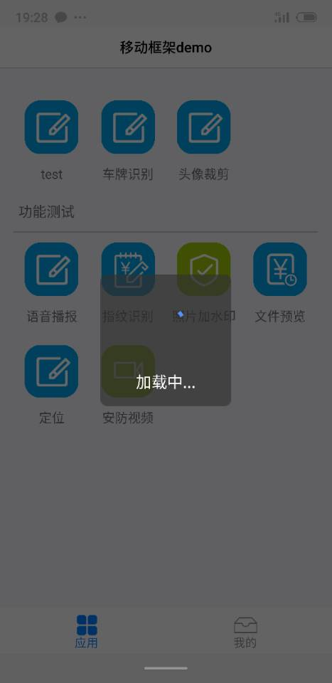

# 移动框架API说明文档

**日期**| **更新人**|**更新内容**|**版本**|**备注**
---|---|---|---|---
2018.3.21|张兴康|创建|V1.0|初版
2018.9.05|张兴康|增加API| V1.1|本次新增内容：18、19、20、21
2018.9.29|张兴康|排版、增加API|V1.2|本次更新内容：17.1.2
2019.2.19|张兴康|增加、更新API|V1.3|
2019.9.29|宋伟伟|重新排版，更新API|V1.4|
2019.12.26|宋伟伟|更新海康安全平台等API|V1.5|

>此文档对应《移动框架开发手册V2.3》

插件名称|插件介绍| 插件版本
---|---|---
基础类库|框架主体| 4.3.3-release
百度导航|集成百度导航，提供类似百度地图的导航体验| 4.0.1-release
NFC|提供NFC读写卡操作，支持手机、手持机|  4.0.0-release
OCR|提供离线车牌号识别|4.0.0-release
视频处理|提供视频的压缩处理，大幅压缩视频体积| 4.1.0-release
音频处理|集成百度语音播报、科大讯飞语音识别功能|4.0.2-release
网络摄像头| 提供海康威视、大华、宇视品牌摄像头、硬盘录像机的视频预览、回放、云台控制、拍照、录像等功能|4.0.9-release
百度消息推送|集成百度消息推送| 4.0.1-release
友盟消息推送|集成友盟聚合推送，支持华为、小米、魅族、OPPO、VIVO五家厂商推送|4.0.3-release
成为手持机| 成为手持机专用，集成手持机的拍照、二维码扫描、打印等操作| 4.0.1-release
海康安全平台|集成海康威视安全平台，通过此平台间接预览、控制、回放摄像头|4.0.5-release
社会化分享| 集成友盟社会化分享，暂只支持分享链接到微信|4.0.0-release

# 总体介绍

移动框架使用混合开发模式，使用HTML/JS开发展示页面，使用Native原生实现底层硬件控制、JS无法实现的通用模块。框架提供数十个插件快速实现业务逻辑，研发只需要掌握html、js、css技术即可快速实现功能，一次开发同时支持Android、IOS、微信公众号。

本文档针对每个插件的调用API进行详细说明介绍。

## 返回方式

插件API调用时，框架提供三种返回方式：同步返回、异步返回-字符串回调、异步返回-方法返回。后续版本异步返回统一使用方法返回，字符串回调逐步废弃。

在插件API使用介绍时，如有返回值，则按照以下用法接收返回值，每个API不再详细。

### 同步返回

同步返回即调用插件API时，直接返回结果，使用方便，但会阻塞主线程。同步返回插件API不要在for循环中高频调用，否则会造成程序卡顿，影响用户体验。

例如： `var value = cmApi.localStorage.getItem("xxx")`;

### 异步返回-字符串回调

异步返回即调用插件API时，直接异步结果，不会阻塞主线程，但使用不便。需要定义回调函数，并将其暴露出去。

```js
var onViewInit = function(obj){
    window.handWriteModule = obj;//确认方法模块名称
}
var onPageDestroy = function(){
    delete window.handWriteModule;
}
function handWrite(){
    //调用时传递字符串格式的回调，格式为：方法模块名称.回调函数名称
    cmApi.handwrite.start(null,'handWriteModule.handWriteCallback')
}
//定义回调函数
function handWriteCallback(ret) {
    $$("#handWrite").attr('src',ret.data.imgUrl);
}
return {
    onViewInit : onViewInit,
    onPageDestroy : onPageDestroy,
    handWrite:handWrite,
    handWriteCallback : handWriteCallback//回调函数中暴露该方法供框架调用
}
```

### 异步返回-方法回调

异步返回即调用插件API时，直接异步结果，不会阻塞主线程，支持直接传递回调处理逻辑或传递回调方法，使用比字符串回调方式简单。且无需暴露回调函数更安全。

```js
function openImagePicker(){
    var params = { maxCount: 3 };
    //直接传递回调参数
    cmApi.filePicker.openImagePicker({
    params: params,
    success: imagePickerSuccess(filePaths),
    error: function(msg) { alert("error:" + msg);}
    });
}
//传递回调方法，无需在 return 中暴露
function imagePickerSuccess(filePaths) {
  $$("#filepicker_filepath").val(filePaths);
  $$("#filepicker_image").attr('src', filePaths);
}
```

## 微信公众号插件支持

因微信API限制，移动框架的部分API在微信公众号无法使用，支持情况如下：


| 插件名称 | 插件方法 | 插件方法说明| 支持情况   |
|---|---|---|---|
| 设备信息 | `cmApi.device.getDeviceId`  | 获取设备唯一标识 | 支持|
| 设备信息 | `cmApi.device.getVersion`   | 获取系统版本| 支持|
| 设备信息 | `cmApi.device.getModel`| 获取手机型号| 支持|
| 设备信息 | `cmApi.device.getBrand`| 获取手机品牌| 支持|
| 设备信息 | `cmApi.device.getType` | 获取手机系统类型 | 支持|
| APP信息  | `cmApi.appUtil.getAppVersionCode`  | 获取app版本号    | 支持|
| APP信息  | `cmApi.appUtil.getAppName`  | 获取app名称 | 支持|
| APP信息  | `cmApi.appUtil.getNetWorkType`| 获取当前网络类型 | 支持|
| APP信息  | `cmApi.appUtil.downloadApk` | 下载APK安装包    | 支持|
| 本地数据库操作  | `cmApi.jdbc.execSelectSQL`  | 数据库查询| **不支持** |
| 本地数据库操作  | `cmApi.jdbc.execUpdateSQL`  | 数据库更新| **不支持** |
| 用户定位及导航  | `cmApi.map.locate`   | 用户定位  | 支持|
| 用户定位及导航  | `cmApi.map.navigate` | 百度导航  | **不支持** |
| 网络请求 | `cmApi.request.commHttpPostAsync`  | 异步网络请求| 支持|
| 网络请求 | `cmApi.request.reportFormHttpPostAsync`   | 报表请求  | 支持|
| 消息推送 | `cmApi.push.init`    | 初始化推送| **不支持** |
| 消息推送 | `cmApi.push.onBind`  | 推送绑定  | **不支持** |
| NFC | `cmApi.nfc.isNfcExists`| 判断手机是否支持nfc功能 | **不支持** |
| NFC | `cmApi.nfc.isNfcEnabled`    | 判断手机是否开启nfc功能 | **不支持** |
| NFC | `cmApi.nfc.startReadCard`   | nfc读卡   | **不支持** |
| NFC | `cmApi.nfc.stopReadCard`    | 停止nfc读卡 | **不支持** |
| NFC | `cmApi.nfc.writeCard`| nfc写操作 | **不支持** |
| NFC | `cmApi.nfc.resetCardInfo`   | 重置nfc卡信息    | **不支持** |
| 蓝牙打印 | `cmApi.bluetoothPrinter.setTitle`  | 设置蓝牙打印的标题 | **不支持** |
| 蓝牙打印 | `cmApi.bluetoothPrinter.setInfo`   | 设置蓝牙打印的内容 | **不支持** |
| 蓝牙打印 | `cmApi.bluetoothPrinter.setTyp`    | 设置蓝牙打印的打印类型  | **不支持** |
| 蓝牙打印 | `cmApi.bluetoothPrinter.printer`   | 开始打印  | **不支持** |
| 蓝牙打印 | `cmApi.bluetoothPrinter.destroyBluetooth` | 停止打印  | **不支持** |
| 手写签名 | `cmApi.handwrite.start`| 手写签名  | **不支持** |
| 二维码   | `cmApi.qrCode.createQRCode` | 生成二维码| 支持|
| 二维码   | `cmApi.qrCode.scan`  | 二维码扫描| 支持|
| 拍照| `cmApi.photo.photograph`    | 相机拍照  | 支持|
| 拍照| `cmApi.image.watermarkText` | 添加文字水印| **不支持** |
| 拍照| `cmApi.image.watermaskImage`| 添加照片水印| **不支持** |
| 拍照| `cmApi.image.compressByScale` | 照片等比例压缩   | 支持|
| 拍照| `cmApi.image.compressByScale` | 照片按大小压缩   | 支持|
| 视频| `cmApi.video.show`   | 安防监控  | **不支持** |
| 视频| `cmApi.video.playback` | 录像回放  | **不支持** |
| 视频| `cmApi.video.record` | 手机录像  | **不支持** |
| 视频| `cmApi.video.compress` | 视频压缩  | **不支持** |
| 语音播报 | `cmApi.speech.startSpeak`   | 开始播放  | **不支持** |
| 语音播报 | `cmApi.speech.stopSpeak`    | 停止播放  | **不支持** |
| 手机认证 | `cmApi.fingerprint.startAuthenticate`| 开始认证  | **不支持** |
| 手机认证 | `cmApi.fingerprint.cancelAuthenticate`    | 停止认证  | **不支持** |
| 手机认证 | `cmApi.fingerprint.isSupport` | 是否支持认证| **不支持** |
| OCR识别  | `cmApi.ocr.speechRecognition` | 语音识别  | **不支持** |
| OCR识别  | `cmApi.ocr.licenseRecognition`| 车牌号识别| **不支持** |
| OCR识别  | `cmApi.ocr.idCardRecognition` | 身份证识别| **不支持** |
| 文件| `cmApi.file.uploadFiles`    | 文件上传  | 支持|
| 文件| `cmApi.file.downloadFiles`  | 文件下载  | **不支持** |
| 文件| `cmApi.document.preview`    | 文件预览  | **不支持** |
| 文件| `cmApi.file.delete`  | 文件删除  | **不支持** |
| 文件| `cmApi.file.getMd5`  | 获取文件MD5值    | **不支持** |
| 文件| `cmApi.file.rename`  | 文件重命名| **不支持** |
| 文件| `cmApi.file.copy`    | 文件复制  | **不支持** |
| 文件| `cmApi.file.mkdirs`  | 文件新建子目录   | **不支持** |
| configs配置文件 | `cmApi.config.getItem` | 获取配置信息| **不支持** |
| configs配置文件 | `cmApi.config.isDebug` | chrome浏览器调试模式    | **不支持** |
| configs配置文件 | `cmApi.config.isCompatibility`| 兼容模式  | **不支持** |
| 文件选择器 | `cmApi.FilePicker.openImagePicker` | 相册选择器| 支持|
| 文件选择器 | `cmApi.FilePicker.openVideoPicker` | 视频选择器| **不支持** |
| 文件选择器 | `cmApi.FilePicker.openAudioPicker` | 音频选择器| **不支持** |
| 文件选择器 | `cmApi.FilePicker.openFilePicker`  | 文件选择器| **不支持** |
| 数据存储 | `cmApi.LocalStorage.getItem`| 获取数据  | 支持|
| 数据存储 | `cmApi.LocalStorage.setItem`| 存储数据  | 支持|
| 手持机   | `cmApi.handset.readIdCard`  | 读卡 | **不支持** |
| 手持机   | `cmApi.handset.closeIdCard` | 关闭读卡  | **不支持** |
| 手持机   | `cmApi.handset.print`| 打印 | **不支持** |
| 手持机   | `cmApi.handset.scanBarCode` | 二维码扫描| **不支持** |
| 手持机   | `cmApi.handset.scanBarCodeBindKey` | 开启二维码扫描按键 | **不支持** |
| 手持机   | `cmApi.handset.scanBarCodeUnBindKey` | 关闭二维码扫描按键 | **不支持** |
| 监听| `cmApi.eventListener.add`   | 添加监听  | **不支持** |
| 监听| `cmApi.eventListener.remove`| 移除监听  | **不支持** |
| 监听| `cmApi.eventListener.clear` | 清楚监听  | **不支持** |

#  插件API使用说明

##  基本操作

### 功能路由

#### 功能跳转

实现app中不同功能之间的跳转。

方法：

- `cmApi.router.turnToPage(funcname)`;
- `cmApi.router.turnToPage(funcname,parameter)`;

参数列表：

参数名|  类型| 描述
---|---|---
funcname|String|功能名称，即functionConfig.js中配置的funcname
parameter|Object|页面传递的参数

返回值：

无

增加版本：

V4.0

示例：

`cmApi.router.turnToPage('demo',{'djnm': '1'})`;

#### 加载新页面（html路径）

方法：

`cmApi.router.load(htmlpath)`

参数列表：

  
参数名| 类型| 描述
---|---|---
htmlpath|String|需要加载页面的相对路径
  

返回值：

无

增加版本：

V3.0

示例：

`cmApi.router.load(htmlpath)`;

#### 加载新页面（html代码）

方法：

`cmApi.router.loadContent(htmlcontent)`

参数列表：

  
参数名|类型| 描述
---|---|---
htmlcontent|String|需要加载的html内容
  

返回值：

无

增加版本：

V3.0

示例：

`cmApi.router.loadContent('<div>deom</div>')`

#### 重新加载页面（html代码）

方法：

`cmApi.router.reloadContent(path)`

参数列表：

参数名|类型| 描述
---|---|---
path| String|加载内容的路径

返回值：

无

增加版本：

V3.0

示例：

`cmApi.router.reloadContent('<div>deom</div>')`

#### 加载新页面（html网络地址）

方法：

`cmApi.router.loadPage(url)`

参数列表：

  
参数名|类型| 描述
---|---|---
url|  String|需要加载页面的网络地址
  

返回值：

无

增加版本：

V3.0

示例：

`cmApi.router.loadHtml('www.baidu.com')`;

#### 重新加载页面（html网络地址）

方法：

`cmApi.router.reloadPage(url)`

参数列表：

  
参数名|类型| 描述
---|---|---
url|  String|需要加载页面的url
  

返回值：

无

增加版本：

V3.0

示例：

> `cmApi.router.reloadHtml('www.baidu.com')`;

### 服务器地址

设置后端服务地址以及获取后端服务地址。

>注：通过setServerUrl设置服务地址并不会修改configs.properties中的app.server.url值，故服务地址修改后，getServerUrl会与config.getItem("app.server.url")不一致

#### 设置服务地址

方法：

`cmApi.setServerUrl(value)`

参数列表：

  
参数名|类型| 描述
---|---|---
value|String|服务器完整地址，例如http://10.200.64.78:8080
  

返回值：

无；

增加版本：

V4.0

示例：

`cmApi.setServerUrl("http://10.200.64.78:8080")`;

#### 获取服务地址

方法：

`cmApi.getServerUrl()`

参数列表：

无

返回值：

参数名|  类型| 描述
---|---|---
serverUrl|String|服务器完整地址，例如http://10.200.64.78:8080

返回方式：

同步

增加版本：

V4.0

示例：

var serverUrl = `cmApi.getServerUrl()`;

#### 设置服务地址（已废弃）

V4.0已废弃，但可继续使用。请使用setServerUrl。

方法：

`cmApi.setIp(value)`

参数列表：

参数名|类型| 描述
---|---|---
value|String|服务IP地址，例如10.200.64.78:8080

返回值：

无

增加版本：

V3.0

示例：

`cmApi.setServerUrl("http://10.200.64.78:8080")`;

#### 获取服务地址（已废弃）

V4.0已废弃，但可继续使用。请使用getServerUrl。

方法：

`cmApi.getIp()`

参数列表：

无

返回值：

参数名|类型| 描述
---|---|---
ip|String|服务器IP地址，例如10.200.64.78:8080

返回方式：

同步

增加版本：

V3.0

示例：

var ip = `cmApi.getIp()`;

### 加载框

展示或隐藏加载提示框，在处理较长任务时可使用，效果如下图。



#### 展示加载框

方法：

`cmApi.showLoadingDialog()`

参数列表：

无

返回值：

无

增加版本：

V3.0

示例：

`cmApi.showLoadingDialog()`;

#### 取消加载框

方法：

`cmApi.hideLoadingDialog()`

参数列表：

无

返回值：

无

增加版本：

V3.0

示例：

`cmApi.hideLoadingDialog()`;

### 信息提示

给当前视图显示一个浮动的显示块，不会获得焦点，3秒后自动消失。一般用于提示一些不重要但是又希望用户看见的消息，例如单据保存成功后提示"单据保存成功"。

#### 信息提示

方法：

- `cmApi.prompt.toast(msg)`
- `cmApi.prompt.toast(msg,title)`

参数列表：

  
参数名|类型| 描述
---|---|---
msg|  String|提示信息
title|String|提示信息标题（可以为空）
  

返回值：

无

增加版本：

V3.0

示例：

- `cmApi.prompt.toast('单据保存成功')`;
- `cmApi.prompt.toast('单据保存成功', '提示')`;

### APP信息

用于查询有关app的相关信息。

#### 获取app版本号

方法：

`cmApi.appUtil.getAppVersionCode()`

参数列表：

无

返回值：

参数名|类型| 描述
---|---|---
appVersionCode|String|APP版本号，例如101

返回方式：

同步

增加版本：

V3.0

示例：

var appVersionCode = `cmApi.appUtil.getAppVersionCode()`;

#### 获取app名称

方法：

`cmApi.appUtil.getAppName()`

参数列表：

无

返回值：

  
参数名|类型| 描述
---|---|---
appName|String|APP名称
  

返回方式：

同步

增加版本：

V3.0

示例：

var appName = `cmApi.appUtil.getAppName()`;

#### 获取当前网络类型（已废弃）

> V4.0已废弃，但可继续使用。请使用network.getNetworkType。

方法：

`cmApi.appUtil.getNetWorkType()`

参数列表：

无

返回值：

参数名|类型| 描述
---|---|---
networkType|String|网络类型，WIFI、MOBILE、OTHER

返回方式：

同步

增加版本：

V3.0

示例：

var networkType = `cmApi.appUtil.getNetWorkType()`;

#### 检查更新（已废弃）

>检查app更新，用于android版本。V4.0已废弃，不能使用，请业务判断是否需要更新。

方法：

`cmApi.appCheckUpdate(flag,zznm,systemType,appName,appVersionCode)`

参数列表：

参数名|类型|描述
---|---|---
flag| Int|0：进入app时进行检查更新；1：我的关于页面，手动点击检查更新；
zznm|组织内码
systemType|  系统类型（只针对android）
appName| App名称
appVersionCode|  App版本号

返回值：

无

增加版本：

V3.0

示例：

- `cmApi.appCheckUpdate(0,cmApi.userInfo.getZznm(),cmApi.device.getType()`,
- `cmApi.appUtil.getAppName,cmApi.appUtil.getAppName.getAppVersionCode)`;

#### 下载并安装apk 

> APP完成下载后会自动调用安装程序。

方法：

`cmApi.appUtil.downloadApk(url)`

参数列表：
  
参数名|类型| 描述
---|---|---
url|  String|apk下载地址
  

返回值：

无

增加版本：

V4.0

示例：

`cmApi.appUtil.downloadApk('http://10.24.18.224:8080/igmcloud/downloadAPP)`;

### 设备信息

获取手机设备基础信息。

#### 获取设备唯一标识

方法：

`cmApi.device.getDeviceId()`

参数列表：

无

返回值：

参数名| 类型| 描述
---|---|---
deviceId|String|设备唯一标识

返回方式：

同步

增加版本：

V3.0

示例：

var deviceId = `cmApi.device.getDeviceId()`;

#### 获取系统版本

方法：

`cmApi.device.getVersion()`

参数列表：

无

返回值：

参数名|类型| 描述
---|---|---
version|String|系统版本，例如9.0
  

返回方式：

同步

增加版本：

V3.0

示例：

var version = `cmApi.device.getVersion()`;

#### 获取手机型号

方法：

`cmApi.device.getModel()`

参数列表：

无

返回值：

phoneModel String类型；

返回值：

参数名|类型| 描述
---|---|---
phoneModel|String|手机型号，比如 Xiaomi 8

返回方式：

同步

增加版本：

V3.0

示例：

var phoneModel = `cmApi.device.getModel()`;

#### 获取手机品牌

方法：

`cmApi.device.getBrand()`

参数列表：

无

返回值：

  
参数名|类型| 描述
---|---|---
phoneBrand|String|手机品牌，比如 Xiaomi
  

返回方式：

同步

增加版本：

V3.0

示例：

var phoneBrand = `cmApi.device.getBrand()`;

#### 获取手机类型

方法：

`cmApi.device.getType()`

参数列表：

无

返回值：

参数名|类型| 描述
---|---|---
mobileType|String|手机类型，分为android、ios

返回方式：

同步

增加版本：

V3.0

示例：

var mobileType = `cmApi.device.getType()`;

#### 获取手机屏幕像素高度

方法：

`cmApi.device.getScreenHeight()`

参数列表：

无

返回值：

参数名|类型|描述
---|---|---
height|Int|屏幕高度

返回方式：

同步

增加版本：

V4.0

示例：

var height = `cmApi.device.getScreenHeight()`;

#### 获取手机屏幕像素高度

方法：

`cmApi.device.getScreenWidth()`

参数列表：

无

返回值：

参数名|类型|描述
---|---|---
width|Int|屏幕宽度

返回方式：

同步

增加版本：

V4.0

示例：

var width = `cmApi.device. getScreenWidth ()`;

#### 设置状态栏颜色

方法：

`cmApi.device.setWindowStatusBarColor(color)`

参数列表：

  
参数名|类型| 描述
---|---|---
color|String|颜色代码，例如 `#FFFFFF`
  

返回值：

无

增加版本：

V3.0

示例：

`cmApi.device.setWindowStatusBarColor("#FFFFFF")`;

#### 是否平板设备

方法：

`cmApi.device.isTabletDevice()`

参数列表：

无

返回值：

|参数名|  类型| 描述
---|---|---|
| isTabletDevice | String | 0：手机 1：平板 |

返回方式：

同步

增加版本：

V3.0

示例：

var mobileType = `cmApi.device.getType()`;

### 配置文件

获取APP配置信息，读取configs.properties配置文件数据，不支持配置修改。

>注：通过setServerUrl设置服务地址并不会修改configs.properties中的app.server.url值，故服务地址修改后，getServerUrl会与config.getItem（"app.server.url"）不一致

#### 获取配置信息

方法：

`cmApi.config.getItem(key)`

参数列表：

  
参数名|类型| 描述
---|---|---
key|  String|配置标识
  

返回值：

  
参数名|类型| 描述
---|---|---
value|String|配置值
  

返回方式：

同步

增加版本：

V4.0

示例：

var value = `cmApi.config.getItem(key)`;

#### 调试模式

方法：

`cmApi.config.isDebug()`

参数列表：

无

返回值：

  
参数名|类型|  描述
---|---|---
value|Boolean|是否开启调试模式
  

返回方式：

同步

增加版本：

V4.0

示例：

var isDebug = `cmApi.config.isDebug()`;

#### 兼容模式

方法：

`cmApi.config.isCompatibility()`

参数列表：

无；

返回值：

BOOL类型；

增加版本：

V4.0

示例：

`cmApi.config.isCompatibility()`;

### 本地存储

将数据存储在手机中，APP卸载时，数据清空。适合用于保存APP配置参数，例如配置开关、用户名等数据。

#### 存储数据

方法：

`cmApi.localStorage.setItem(key,value)`;

参数列表：

参数名|类型| 描述
---|---|---
key|  String|存储信息标识
value|String|存储信息

返回值：

无

增加版本：

V4.0

示例：

`cmApi.localStorage.setItem("username",userJson.loginUserName)`;

#### 获取数据

方法：

`cmApi.localStorage.getItem(key)`;

参数列表：

参数名|类型| 描述
---|---|---
key|  String|存储信息标识

返回值：

参数名|类型| 描述
---|---|---
value|String|存储信息

返回方式：

同步

增加版本：

V4.0

示例：

var value = `cmApi.localStorage.getItem("xxx")`;

#### 存储数据（已废弃）

V4.0已废弃，但可继续使用。请使用localStorage.setItem。使用setStringSession保存的数据支持使用新接口getItem获取。

方法：

`cmApi.setStringSession(key,value)`

参数列表：

参数名|类型| 描述
---|---|---
key|  String|存储信息标识
value|String|存储信息

返回值：

无

增加版本：

V3.0

示例：

`cmApi.getStringSession("username",userJson.loginUserName)`;

#### 获取数据（已废弃）

V4.0已废弃，但可继续使用。请使用localStorage.getItem。使用setStringSession保存的数据支持使用新接口getItem获取。

方法：

`cmApi.getStringSession(key)`

参数列表：

参数名|类型| 描述
---|---|---
key|  String|存储信息标识

返回值：

参数名|类型| 描述
---|---|---
value|String|存储信息

返回方式：

同步

增加版本：

V3.0

示例：

var value = `cmApi.getStringSession("username")`;

### 退出

彻底退出app应用程序。

#### APP退出

方法：

`cmApi.appExit()`

参数列表：

无

返回值：

无

增加版本：

V3.0

示例：

`cmApi.appExit()`;

###  网络状态

#### 是否有网路

方法：

`cmApi.network.isConnect()`

参数列表：

无

返回值：

参数名|  类型|  描述
---|---|---
isConnect|Boolean|是否有网络

返回方式：

同步

增加版本：

V4.0

示例：

var isConnect = `cmApi.network.isConnect()`;

#### 获取当前网络类型

方法：

`cmApi.network.getNetworkType()`

参数列表：

无

返回值：

参数名|类型| 描述
---|---|---
networkType|String|网络类型，WIFI、MOBILE、OTHER

返回方式：

同步

增加版本：

V4.0

示例：

var networkType = `cmApi.network.getNetworkType()`;

#### ping

方法：

`cmApi.network.ping(ip,timeout)`

参数列表：

参数名|类型| 描述
---|---|---
ip|String|ip地址
timeout|Int|  超时时间，单位秒，默认3秒

返回值：

参数名|类型|  描述
---|---|---
isPing|Boolean|是否ping通

返回方式：

同步

增加版本：

V4.0

示例：

var isPing = `cmApi.network.ping("192.168.0.1",3)`;

## 用户信息

用于获取登录用户的一些基本信息。用户登录后可以使用，如果获取为空，请检查登录逻辑中是否保存。

### 获取用户唯一标识

方法：

`cmApi.userInfo.getUserId()`

参数列表：

无

返回值：

参数名|类型| 描述
---|---|---
userId|String|用户唯一标识

返回方式：

同步

增加版本：

V3.0

示例：

var userId = `cmApi.userInfo.getUserId()`;

### 获取用户绑定标识

方法：

`cmApi.userInfo.getBindUserId()`

参数列表：

无

返回值：

参数名|类型| 描述
---|---|---
bindUserId|String|用户绑定在第三方的唯一标识

返回方式：

同步

增加版本：

V3.0

示例：

var userId = `cmApi.userInfo.getBindUserId()`;

### 获取用户内码

方法：

`cmApi.userInfo.getUserNm()`

参数列表：

无

返回值：

参数名|类型| 描述
---|---|---
userNm|String|用户内码

返回方式：

同步

增加版本：

V3.0

示例：

var userNm = `cmApi.userInfo.getUserNm()`;

### 获取用户密码

方法：

`cmApi.userInfo.getUserPwd()`

参数列表：

无

返回值：

参数名|类型| 描述
---|---|---
userPwd|String|用户密码

返回方式：

同步

增加版本：

V3.0

示例：

var password = `cmApi.userInfo.getUserPwd()`;

### 获取用户身份证号

方法：

`cmApi.userInfo.getUserIDCard()`

参数列表：

无

返回值：

参数名|类型| 描述
---|---|---
userIdCard|String|用户身份证号

返回方式：

同步

增加版本：

V3.0

示例：

var userIdCard = `cmApi.userInfo.getUserIDCard()`;

### 获取用户电话

方法：

`cmApi.userInfo.getPhoneNum()`

参数列表：

无

返回值：

参数名| 类型| 描述
---|---|---
phoneNum|String|用户电话

返回方式：

同步

增加版本：

V3.0

示例：

var phoneNum = `cmApi.userInfo.getPhoneNum()`;

### 获取用户组织内码

方法：

`cmApi.userInfo.getZZnm()`

参数列表：

无

返回值：

参数名|类型| 描述
---|---|---
zznm| String|组织内码

返回方式：

同步

增加版本：

V3.0

示例：

var zznm = `cmApi.userInfo.getZZnm()`;

### 获取用户组织名称

方法：

`cmApi.userInfo.getZZmc()`

参数列表：

无

返回值：

  
参数名|类型| 描述
---|---|---
zzmc| String|组织名称
  

返回方式：

同步

增加版本：

V3.0

示例：

var zzmc = `cmApi.userInfo.getZZmc()`;

### 获取用户组织类型

方法：

`cmApi.userInfo.getZZlx()`

参数列表：

无

返回值：

  
参数名|类型| 描述
---|---|---
zzlx| String|组织类型
  

返回方式：

同步

增加版本：

V3.0

示例：

var zzlx = `cmApi.userInfo.getZZlx()`;

### 获取用户分级编码

方法：

`cmApi.userInfo.getFjbm()`

参数列表：

无

返回值：

  
参数名|类型| 描述
---|---|---
fjbm| String|分级编码
  

返回方式：

同步

增加版本：

V3.0

示例：

var fjbm = `cmApi.userInfo.getFjbm()`;

### 获取用户级次

方法：

`cmApi.userInfo.getJc()`

参数列表：

无

返回值：

  
参数名|类型| 描述
---|---|---
jc|String|级次
  

返回方式：

同步

增加版本：

V3.0

示例：

var jc = `cmApi.userInfo.getJc()`;

### 获取用户角色

方法：

`cmApi.userInfo.getRoles()`

参数列表：

无

返回值：

  
参数名|类型| 描述
---|---|---
roles|String|用户角色
  

返回方式：

同步

增加版本：

V3.0

示例：

var roles = `cmApi.userInfo.getRoles()`;

### 获取组织树

方法：

`cmApi.userInfo.getAllZzTree()`

参数列表：

无

返回值：

  
参数名|  类型| 描述
---|---|---
allZzTree|JsonObject|数据库中所有的组织单位
  

返回方式：

同步

增加版本：

V3.0

示例：

var ret = `cmApi.userInfo.getAllZzTree()`;

### 获取当前用户组织树

方法：

`cmApi.userInfo.getCurrentUserZzTree()`

参数列表：

无

返回值：

  
参数名|  类型| 描述
---|---|---
currentUserZzTree|JsonObject|当前用户的组织单位
  

返回方式：

同步

增加版本：

V3.0

示例：

var ret = `cmApi.userInfo.getCurrentUserZzTree()`;

## Http请求


### 发起http

post请求，包含几种不同形式的请求方式。httpPostAsync方法会自动控制加载框，httpPostAsyncNoLoading则没有加载框。

### 异步请求

方法：

- `cmApi.request.httpPostAsync(url,param,callback)`
- `cmApi.request.httpPostAsync(url,param,contentType,callback)`

参数列表：

  
参数名|类型| 描述
---|---|---
url|String|接口地址,与serverUrl组合成接口全地址，例如：service/demo/insert
param| JsonObject|请求参数
contentType|String|编码类型，可不传，默认application/x-www-form-urlencoded ，支持修改例如application/json
callback|  String|回调函数
  

返回值：

  
参数名|类型| 描述
---|---|---
data| JsonObject或String|返回值如果是JSON格式，则返回JsonObject，否则直接返回String
  

返回方式：

异步-字符串回调

增加版本：

V4.0

示例：

`cmApi.request.httpPostAsync('service/demo/insert',params,'demoModule.insertCallback')`;

### 异步请求(不含提示框) 

方法：

- `cmApi.request.httpPostAsyncNoLoading(url,param,callback)`
- `cmApi.request.httpPostAsyncNoLoading(url,param,contentType,callback)`

参数列表：

  
参数名|类型| 描述
---|---|---
url|String|接口地址,与serverUrl组合成接口全地址，例如：service/demo/insert
param| JsonObject|请求参数
contentType|String|编码类型，可不传，默认application/x-www-form-urlencoded ，支持修改例如application/json
callback|  String|回调函数
  

返回值：

  
参数名|类型| 描述
---|---|---
data| JsonObject或String|返回值如果是JSON格式，则返回JsonObject，否则直接返回String
  

返回方式：

异步-字符串回调

增加版本：

V4.0

示例：

`cmApi.request.httpPostAsyncNoLoading('service/demo/insert',params,'demoModule.insertCallback')`;

### 异步请求（转发服务专用）（已废弃）

V4.0已废弃，不能使用。请使用request.commHttpPostAsync。

方法：

`cmApi.request.commHttpPostAsync(ifinfoNm,jParam,callback)`

参数列表：

  
参数名| 类型| 描述
---|---|---
ifinfoNm|String|接口内码
jParam| JsonObject|请求参数
callback|String|回调函数
  

返回值：

  
参数名|类型| 描述
---|---|---
data| JsonObject或String|返回值如果是JSON格式，则返回JsonObject，否则直接返回String
  

返回方式：

异步-字符串回调

增加版本：

V3.0

示例：

`cmApi.request.commHttpPostAsync('demoinsert',params,'demoModule.insertCallback')`;

### 硕正报表请求

方法：

`cmApi.request.reportFormHttpPostAsync(ifinfoNm,jParam,callback)`

参数列表：

  
参数名| 类型| 描述
---|---|---
ifinfoNm|String|接口内码
jParam| JsonObject|请求参数
callback|String|回调函数
  

返回值：

  
参数名|类型| 描述
---|---|---
data| JsonObject或String|返回值如果是JSON格式，则返回JsonObject，否则直接返回String
  

返回方式：

异步-字符串回调

增加版本：

V3.0

示例：

`cmApi.request.reportFormHttpPostAsync('getRform',params,'ckrjdModule.queryReportFormCallback')`;

##  设备通信

### 打电话

方法：

`cmApi.contact.phone(phonenumber)`

参数列表：

  
参数名|类型| 描述
---|---|---
phonenumber|String|手机号
  

返回值：

无

增加版本：

V3.0

示例：

`cmApi.contact.phone("18666666666")`

### 发短信

方法：

`cmApi.contact.sms(phonenumber)`

参数列表：

  
参数名|类型| 描述
---|---|---
phonenumber|String|手机号
  

返回值：

无

增加版本：

V3.0

示例：

`cmApi.contact.sms("18666666666")`

## 本地数据库

对手机本地数据库中的数据进行增、删、改、查。APP卸载时，数据清空

### 数据库查询

方法：

`cmApi.jdbc.execSelectSQL(sql,parameters)`

参数列表：

  
参数名|类型| 描述
---|---|---
sql|  String|Sql查询语句
parameters|JsonObject|参数
  

返回值：

参数名|类型| 描述
---|---|---
data| String|JSONArray格式的字符串

返回方式：

同步

增加版本：

V3.0

示例：

```js
var sql = "SELECT CF_CFNM FROM CRK_CF WHERE CF_ZZNM = 'zznm'";
var data = `cmApi.jdbc.execSelectSQL(sql)`;
```

### 数据库更新

方法：

`cmApi.jdbc.execUpdateSQL(sql,parameters)`

参数列表：

  
参数名|类型| 描述
---|---|---
sql|  String|Sql更新语句
parameters|JsonObject|参数
  

返回值：

  
参数名|类型|描述
---|---|---
data| int|更新条数
  

返回方式：

同步

增加版本：

V3.0

示例：

```js
var sql = "DELETE FROM CRK_CF WHERE CF_ZZNM = 'zznm'";
var index = `cmApi.jdbc.execUpdateSQL(sql)`;
```

## 地图


集成百度地图，定位默认使用GCJ02坐标系。百度导航效果类似百度地图。

移动框架支持后端定位用户位置，可以以指定频率反馈位置，便于项目绘制用户轨迹。启动跟踪后会给用户通知提示，关闭跟踪后清除提醒，且提醒无法手动消除，避免用户误解。框架提供"启动跟踪"、"关闭跟踪"、"跟踪状态"3个API接口。

### 用户定位

方法：

`cmApi.map.locate(opts)`

参数列表：


参数名|类型|是否必须|描述
---|---|---|---
params|Object| 是| 初始化参数
success|Function|否| 成功回调
error| Function|否| 失败回调


params格式：

参数名| 类型| 是否必须|描述
---|---|---|---

coorType|String|否| 默认gcj02 GCJ02：国测局坐标 BD09ll：百度经纬度坐标 BD09：百度墨卡托坐标


返回值：

参数名|  类型| 描述
---|---|---
latitude|double|纬度
longitude|double|经度
radius|  double|定位精度
address| String|详细地址
  

返回方式：

异步-方法回调

增加版本：

V4.0

示例：

`cmApi.map.locate('demoModule.geolocationCallback')`;

### 用户定位(已废弃)

V4.0已废弃，但可继续使用。请使用push.map.locate。

方法：

`cmApi.map.locate(callback)`

参数列表：

  
参数名| 类型| 描述
---|---|---
callback|String|回调函数
  

返回值：

  
参数名|  类型| 描述
---|---|---
latitude|double|纬度
longitude|double|经度
radius|  double|定位精度
  

返回方式：

异步-字符串回调

增加版本：

V3.0

示例：

`cmApi.map.locate('demoModule.geolocationCallback')`;

### 百度导航

实现起始位置的在线导航功能。依赖百度导航扩展插件。

方法：

`cmApi.map.navigate(opts)`

参数列表：

  
参数名|类型| 描述
---|---|---
slng| String|起点经度
slat| String|起点纬度
sloc| String|起点地址
elng| String|终点经度
eloc| String|终点纬度
eloc| String|终点地址
  

返回值：

无

增加版本：

V4.0

示例：

```js
var opts = {slng: '',slat: '',elng: '',elat: '',eloc: ''};
cmApi.map.navigate(opts);
```

### 后台跟踪启动

移动框架支持后端定位用户位置，可以以指定频率反馈位置，便于项目绘制用户轨迹。启动跟踪后会给用户通知提示，关闭跟踪后清除提醒，且提醒无法手动消除，避免用户误解。

方法：

`cmApi.map.startTrace(opts)`

参数列表：

  
参数名|类型| 描述
---|---|---
opts| Object|对象
  

**opts参数**

  
参数名|类型|描述
---|---|---
params|Object| 参数
success|Function|成功回调
error| Function|失败回调
  

**params参数**

|参数名|  类型| 是否必须| 描述
---|---|---|---
| coorType| String|   否|  坐标系 GCJ02：火星坐标系，国家测绘地理信息局制定，国内最广泛使用的坐标体系。BD09ll：百度经纬度坐标。BD09：百度墨卡托坐标。默认：GCJ02
| spin| int|  否|  定位频率，接口会按此时间间隔调 ，用回调函数返回位置信息，单位秒 ，默认：60
notification| Object|   否|   启动跟踪后的通知提示，Android端独有参数，iOS系统无效。默认：无通知提示 

**notification参数**

参数名|类型| 是否必须|描述
---|---|---|---
title|String|是| 通知标题
text| String|是| 通知文本


返回值：

参数名|  类型| 描述
---|---|---
latitude|Double|纬度
longitude|Double|经度
radius|  Float|误差范围，单位米
time|String|定位时间

返回方式：

异步-方法回调

增加版本：

V4.3.0

示例：

```js
function startTrace(){
  var notification = {
    title: "正在后台定位",
    text: "寻仓功能正在后台定位"
  };
  var params = {
    coorType: "gcj02",
    span: 60,
    notification : notification
  };
  cmApi.map.startTrace({
      params: params,
      success: function(location) {
        $$('#geolocation_latitude').val(location.latitude);
        $$("#geolocation_longitude").val(location.longitude);
        $$("#geolocation_radius").val(location.radius);
        $$("#geolocation_time").val(location.time);
      },
      error: function(msg) {
        alert("error:" + msg);
      }
  });
}
```

### 后台跟踪关闭

移动框架支持后端定位用户位置，可以以指定频率反馈位置，便于项目绘制用户轨迹。关闭跟踪后会清除跟踪提醒。

方法：

`cmApi.map.stopTrace(opts)`

参数列表：

  
参数名|类型| 描述
---|---|---
opts| Object|对象
  

opts参数

  
参数名|类型|描述
---|---|---
success|Function|成功回调
error| Function|失败回调
  

返回值：

  
参数名|类型|  描述
---|---|---
status|Boolean|是否关闭
  

返回方式：

异步-方法回调

增加版本：

V4.3.0

示例：

```js
function stopTrace(){
    cmApi.map.stopTrace({
      success: function(data) {
      alert("success:" + data.status);
    },
    error: function(data) {
      //alert("error:" + msg);
    }
  });
}
```

### 后台跟踪状态

查询后台跟踪的状态情况。

方法：

`cmApi.map.traceStatus(opts)`

参数列表：

  
参数名|类型| 描述
---|---|---
opts| Object|对象
  

opts参数

  
参数名|类型|描述
---|---|---
success|Function|成功回调
error| Function|失败回调
  

返回值：

  
参数名|类型|  描述
---|---|---
status|Boolean|运行状态
  

返回方式：

异步-方法回调

增加版本：

V4.3.0

示例：

```js
function traceStatus(){
  cmApi.map.traceStatus({
    success: function(data) {
      $$('#geolocation_status').val(data.status);
      myApp.alert('运行状态：' + data.status, '提示');
    },
    error: function(data) {
      alert("error:" + msg);
    }
  });
}
```

## 二维码


### 生成二维码

创建二维码图片，并将其显示在div中。

方法：

`cmApi.qrCode.createQRCode(w,h,divId,content)`

参数列表：

  
参数名|类型| 描述
---|---|---
w| String|二维码图片宽度
h| String|二维码图片高度
divId| String|显示二维码图片div的Id
content|String|二维码内容
  

返回值：

无

增加版本：

V3.0

示例：

`cmApi.qrCode.createQRCode("250","250","divId",qrCodeContent)`;

### 二维码扫描

方法：

`cmApi.qrCode.scan(callback)`

参数列表：

  
参数名| 类型| 描述
---|---|---
callback|String|回调函数
  

返回值：

  
参数名|类型| 描述
---|---|---
data| JsonObject或String|返回值如果是JSON格式，则返回JsonObject，否则直接返回String
  

返回方式：

异步-字符串回调

增加版本：

V3.0

示例：

`cmApi.qrCode.scan('mainModule.scanQRcodeCallback')`;

## 消息推送

消息推送支持百度推送、友盟推送。使用百度推送时依赖百度推送扩展插件，使用友盟推送时依赖友盟推送扩展插件。

百度推送不支持增、删标签，不支持静默模式。

### 推送注册

方法：

`cmApi.push.register()`

参数列表：

无

返回值：

参数名|  类型| 描述
---|---|---
pushToken|String|消息推送用户token，后台服务使用此token给用户推送消息

返回方式：

异步-方法回调

增加版本：

V4.1.5

示例：

`cmApi.push.register()`

### 增加标签

方法：

`cmApi.push.addTag(tag)`

参数列表：

参数名|类型| 描述
---|---|---
tag|  String|标签名称，后台服务使用tag给用户组推送消息

返回值：

  
参数名|类型| 描述
---|---|---
tag|  String|标签名称
  

返回方式：

异步-方法回调

增加版本：

V4.1.5

示例：

`cmApi.push.addTag("jinan")`

### 删除标签

方法：

`cmApi.push.delTag(tag)`

参数列表：

  
参数名|类型| 描述
---|---|---
tag|  String|标签名称
  

返回值：

  
参数名|类型| 描述
---|---|---
tag|  String|标签名称
  

返回方式：

异步-方法回调

增加版本：

V4.1.5

示例：

`cmApi.push.delTag("jinan")`

### 标签列表

方法：

`cmApi.push.listTag()`

参数列表：

无

返回值：

  
参数名|类型|描述
---|---|---
tags| JSONArry|标签列表
  

返回方式：

异步-方法回调

增加版本：

V4.1.5

示例：

var tags = `cmApi.push.listTag()`

### 静默模式

方法：

`cmApi.push.setNoDisturbMode()`

参数列表：

  
参数名|类型|描述
---|---|---
startHour| int|静默开始小时
startMinute|int|静默开始分钟
endHour|int|静默结束小时
endMinute| int|静默结束分钟
  

返回值：

无

增加版本：

V4.1.5

示例：

```js
var params = {
  startHour: "21",
  startMinute: "0",
  endHour: "7",
  endMinute: "0"
};
`cmApi.push.setNoDisturbMode({params:params,success:success,error:error})`
```

### 推送初始化（已废弃）

V4.0已废弃，但可继续使用。请使用push.register。

方法：

`cmApi.push.init(url)`

参数列表：

参数名|类型| 描述
---|---|---
url|  String|消息推送初始化成功后的后台调用url

返回值：

无

增加版本：

V3.0

示例：

`cmApi.push.init(url)`;

## 多媒体

### 拍照

拍照完成后，建议调用图片压缩处理，图片压缩可大幅减小照片大小，实现照片快速上传。

#### 拍照

方法：

`cmApi.photo.photograph(filename,callback)`

参数列表：

  
参数名| 类型| 描述
---|---|---
filename|String|照片名称
callback|String|回调函数
  

返回值：

  
参数名|类型| 描述
---|---|---
imgUrl|String|照片路径
  

返回方式：

异步-字符串回调

增加版本：

V4.0

示例：

`cmApi.photo.photograph('myPhoto'，'demoModule.photographCallback')`;

#### 拍照（已废弃）

V4.0已废弃，但可继续使用。请使用photo.photograph。

方法：

`cmApi.photograph(filename,callback)`

参数列表：

  
参数名| 类型| 描述
---|---|---
filename|String|照片名称
callback|String|回调函数
  

返回值：

  
参数名|类型| 描述
---|---|---
imgUrl|String|照片路径
  

返回方式：

异步-字符串回调

增加版本：

V3.0

示例：

`cmApi.photograph('myPhoto'，'demoModule.photographCallback')`;

### 录像

#### 录像

支持录屏增加水印，支持文本水印、动态时间戳水印。视频录制完成后，会调用视频压缩处理，大幅减小视频大小，实现快速上传。压缩时间视设备CPU处理能力。依赖视频处理扩展插件。

方法：

`cmApi.video.record(opts)`

参数列表：

  
参数名|类型| 描述
---|---|---
opts| Object|对象
  

opts参数

  
参数名|类型|描述
---|---|---
params|Object| 参数
success|Function|成功回调
error| Function|失败回调
  

params参数

  
参数名|  类型| 描述
---|---|---
quality| int|  图像质量等级，0、1、2
maxTime| int|  录像最大时长，单位秒
minTime| int|  录像最小时长，单位秒
waterMark|Object|水印参数
  

**waterMark参数**

|参数名| 类型| 是否必须| 描述
---|---|---|---
| type| String|   是|  水印类型|
| text| String|   否| 水印文本，当type==text时必填| 
| color| String|   否|   auto或16进制文字颜色（例 ：`#000000`），当传递auto时自动根据录像底色调整显示黑白颜色，默认值auto |
| size| int|  否|  字体大小，数值越大水印越大，默认值20|  
| position| String|   否| 水印位置，默认值RB |

参数详情：

- type
  - text：文本
  - timestamp：时间戳，格式yyyy-MM-dd HH:mm:ss
  - image：图像，暂不支持 
- position
  - C：中
  - T：上
  - B：下
  - L：左
  - R：右
  - LT：左上
  - LB：左下
  - RT：右上
  - RB：右下

返回值：

参数名|类型| 描述
---|---|---
directory|String|视频存放路径
video|String|视频地址
screenshot|String|视频缩略图
  

返回方式：

异步-方法回调

增加版本：

V4.1.16

示例：

```js
function record(){
  var waterMark = {
   type : 'timestamp',
   position: 'RB'
  };
  var params = {
    waterMark : waterMark,
    quality : 1,
    maxTime: 300,
    minTime: 3
  };
  var opts = {
    params:params,
    success:recordCallback,
    error:recordCallback
  };
  cmApi.video.record({params:params,success:recordCallback,error:recordCallback});
}

function recordCallback(ret) {
  $$("#videoPlayer").attr('src',ret.video);
}
```

#### 录像（已废弃）

视频录制完成后，会调用视频压缩处理，大幅减小视频大小，实现快速上传。压缩时间视设备CPU处理能力。依赖视频处理扩展插件。

方法：

`cmApi.video.record(quality,maxTime,minTime,callback)`

参数列表：

  
参数名| 类型| 描述
---|---|---
quality|int|  图像质量等级，0、1、2
maxTime|int|  录像最大时长，单位秒
minTime|int|  录像最小时长，单位秒
callback|String|回调函数
  

返回值：

  
参数名|类型| 描述
---|---|---
directory|String|视频存放路径
video|String|视频地址
screenshot|String|视频缩略图
  

返回方式：

异步-字符串回调

增加版本：

V4.0

示例：

`cmApi.video.record(2,60,10,'demoModule.recordCallback')`;

#### 录像（已废弃）

V4.0已废弃，不能使用。请使用video.record。

方法：

`cmApi.videorecord(callback)`

参数列表：
  
参数名| 类型| 描述
---|---|---
callback|String|回调函数
  

返回值：

参数名|类型| 描述
---|---|---
path| String|视频存放路径

返回方式：

异步-字符串回调

增加版本：

V3.0

示例：

`cmApi.videoRecord('demoModule.recordCallback')`;

### 录音

#### 录音

方法：

`cmApi.audio.record(filename,callback)`

参数列表：

  
参数名| 类型| 描述
---|---|---
filename|String|照片名称
callback|String|回调函数
  

返回值：

  
参数名|类型| 描述
---|---|---
path| String|录音路径
  

返回方式：

异步-字符串回调

增加版本：

V4.0

示例：

`cmApi.audioRecord('demoModule.audioRecordCallback')`;

#### 录音（已废弃）

V4.0已废弃，但可继续使用。请使用audio.record。

方法：

`cmApi.audioRecord(callback)`

参数列表：

  
参数名| 类型| 描述
---|---|---
callback|String|回调函数
  

返回值：

  
参数名|类型| 描述
---|---|---
path| String|录音路径
  

返回方式：

异步-字符串回调

增加版本：

V3.0

示例：

`cmApi.audioRecord('demoModule.audioRecordCallback')`;

### 图片处理

图片压缩可有效减小照片大小，实现照片快速上传。使用后可体积可压缩10倍左右。

#### 照片压缩

方法：

`cmApi.image.compress(image,callback)`

参数列表：

  
参数名| 类型| 描述
---|---|---
image|  String|照片路径
callback|String|回调函数
  

返回值：

  
参数名|类型| 描述
---|---|---
imgUrl|String|照片路径
  

返回方式：

异步-字符串回调

增加版本：

V4.0

示例：

`cmApi.image.compress('../time.png','module.callback')`;

#### 添加文字水印

方法：

`cmApi.image.watermarkText(image,text,position,size,color)`

参数列表：

|参数名| 类型| 描述
---|---|---|
| image| String | 照片路径|
| text| String | 水印内容|
| position | String | 水印位置
| size| String | 文字大小|
| color| String | 16进制文字颜色（例：`#000000`） |

参数详情：

- position
  - C：中
  - T：上
  - B：下
  - L：左
  - R：右
  - LT：左上
  - LB：左下
  - RT：右上
  - RB：右下

返回值：

无

增加版本：

V4.0

示例：

`cmApi.image.watermarkText('../time.png','inspur','C','1.0','#000000')`;

#### 添加照片水印

方法：

`cmApi.image.watermaskImage(image,maskImage,position,scale)`

参数列表：

|参数名| 类型| 描述
---|---|---| 
| image|  String | 照片路径| |
| maskImage | String | 水印照片路径 |
| position  | String | 水印位置
| scale|  String | 照片比例| 

参数详情：

- position
  - C：中
  - T：上
  - B：下
  - L：左
  - R：右
  - LT：左上
  - LB：左下
  - RT：右上
  - RB：右下

返回值：

无

增加版本：

V4.0

示例：

`cmApi.image.watermaskImage('../time.png','../time1.png', 'C',1.0)`;

#### 照片等比例压缩（已废弃）

V4.1已废弃，但可继续使用。请使用image.compress。

方法：

`cmApi.image.compressByScale(image, scale)`

参数列表：

  
参数名|类型| 描述
---|---|---
image|String|照片路径
scale|String|压缩比例
  

返回值：

无

增加版本：

V4.0

示例：

`cmApi.image.compressByScale('../time.png',1.0)`;

#### 照片按大小压缩（已废弃）

V4.1已废弃，但可继续使用。请使用image.compress。

方法：

`cmApi.image.compressBySize(image,size)`

参数列表：

参数名|类型| 描述
---|---|---
image|String|照片路径
size| String|图片大小（KB）

返回值：

无

增加版本：

V4.0

示例：

`cmApi.image.compressBySize('../time.png' ,'100.0')`;

#### 头像裁剪

方法：

`cmApi.image.headclip(opts)`

参数列表：

  
参数名|类型| 描述
---|---|---
path| String|图片路径
  

返回值：

  
参数名|类型| 描述
---|---|---
path| String|图片路径
  

返回方式：

异步-方法回调

增加版本：

V4.1.5

示例：

`cmApi.image.headclip('../time.png' ,'100.0')`;

### 语音播报

依赖音频处理扩展插件。

#### 播放

方法：

`cmApi.speech.startSpeak(text,speaker)`

参数列表：

参数名|类型| 描述
---|---|---
text|  String|语音播报内容
speaker|String|声音类型：0.男声 1.女声）

返回值：

无

增加版本：

V4.0

示例：

`cmApi.speech.startSpeak("语音播报","0")`;

#### 停止播放

方法：

`cmApi.speech.stopSpeak()`

参数列表：

无

返回值：

无

增加版本：

V4.0

示例：

`cmApi.speech.stopSpeak()`;

### 语音识别

依赖音频处理扩展插件。

#### 语音识别

方法：

`cmApi.speech.recognize(callback)`

参数列表：

  
参数名| 类型| 描述
---|---|---
callback|String|回调函数
  

返回值：

  
参数名|类型| 描述
---|---|---
text| String|识别文字
  

返回方式：

异步-字符串回调

增加版本：

V4.0

示例：

`cmApi.speech.recognize("module.callback")`;

## 文件操作

### 文档预览

文件预览是集成腾讯TBS服务，支持主流数十种文件格式直接预览。

方法：

`cmApi.document.preview(filepath)`

参数列表：

  
参数名| 类型| 描述
---|---|---
filepath|String|文件路径
  

返回值：

无

增加版本：

V4.0

示例：

`cmApi.document.preview(filepath)`

### 文件上传

方法：

`cmApi.file.uploadFile(opts)`

参数列表：

  
参数名|类型| 描述
---|---|---
opts| Object|参数
  

opts参数

   
参数名| 类型| 描述
---|---|---
url|String|上传路径
path|String|文件路径，支持上传多个文件，以英文分号;进行分割
showProgress|Boolean|  是否展示进度条，默认展示
showToast|  Boolean|  上传完成是否提醒，默认提醒
params| JsonObject|请求参数
   

返回值：

参数名|类型| 描述
---|---|---
data| JsonObject或String|返回值如果是JSON格式，则返回JsonObject，否则直接返回String
  

返回方式：

异步-方法回调

增加版本：

V4.0

示例：

```js
var businessParams = {djnm: "xxxx"};
var params = {url:url,path:path,params:businessParams};
cmApi.file.uploadFile({params:params,success:success,error:error});
```

### 文件上传（已废弃）

V4.1已废弃，但可继续使用。请使用file.uploadFile。

方法：

`cmApi.file.upload(url,path,params,callback)`

参数列表：

  
参数名| 类型| 描述
---|---|---
url|String|上传路径
path|String|文件路径
params| JsonObject|请求参数
callback|String|回调函数
  

返回值：

  
参数名|类型| 描述
---|---|---
data| JsonObject或String|返回值如果是JSON格式，则返回JsonObject，否则直接返回String
  

返回方式：

异步-字符串回调

版本说明：

V3.0

示例：

`cmApi.file.upload(url,path,params,'demoModule.uploadImgCallback')`;

### 文件下载

方法：

`cmApi.file.downloadFile(opts)`

参数列表：

   
参数名| 类型|  描述
---|---|---
url|String|下载路径
path|String|文件路径
showProgress|Boolean|是否展示进度条，默认展示
showToast|  Boolean|完成是否提醒，默认提醒
   

返回值：

  
参数名|类型| 描述
---|---|---
data| JsonObject或String|返回值如果是JSON格式，则返回JsonObject，否则直接返回String
  

返回方式：

异步-方法回调

增加版本：

V4.0

示例：

```js
var params = {url:url,path:path };
cmApi.file.downloadFile({params:params,success:success,error:error};
```

### 文件下载（已废弃）

V4.1已废弃，但可继续使用。请使用file.downloadFile。

方法：

`cmApi.file.download(url,path,callback)`

参数列表：

  
参数名| 类型| 描述
---|---|---
url|String|下载路径
path|String|文件路径
callback|String|回调函数
  

返回值：

  
参数名|类型| 描述
---|---|---
data| JsonObject或String|返回值如果是JSON格式，则返回JsonObject，否则直接返回String
  

返回方式：

异步-字符串回调

增加版本：

V4.0

示例：

`cmApi.file.download(url,path,'demoModule.downloadImgCallback')`;

### 文件删除

方法：

`cmApi.file.delete(path)`

参数列表：

  
参数名|类型| 描述
---|---|---
path| String|文件路径
  

返回值：

无

增加版本：

V4.0

示例：

`cmApi.file.delete(path)`;

### 文件删除

V4.0已废弃，但可继续使用。请使用file.delete。

方法：

`cmApi.deleteLocalImg(path)`

参数列表：

  
参数名|类型| 描述
---|---|---
path| String|文件路径
  

返回值：

无

增加版本：

V3.0

示例：

`cmApi.deleteLocalImg(path)`;

### 文件重命名

方法：

`cmApi.file.rename(opts)`

参数列表：

  
参数名|类型| 描述
---|---|---
oldPath|String|旧文件路径
newName|String|新文件名
  

返回值：

  
参数名|类型| 描述
---|---|---
newName|String|新文件名
  

返回方式：

异步-方法回调

增加版本：

V4.0

示例：

```js
var params = {oldPath:oldPath,newName:newName};
cmApi.file.rename({params:params,success:success,error:error};
```

### 文件复制

方法：

`cmApi.file.copy(opts)`

参数列表：

  
参数名|类型| 描述
---|---|---
oldPath|String|旧文件路径
newPath|String|新文件路径
  

返回值：

  
参数名|类型| 描述
---|---|---
newPath|String|新文件路径
  

返回方式：

异步-方法回调

增加版本：

V4.0

示例：

```js
var params = {oldPath:oldPath,newPath:newPath};
cmApi.file.copy({params:params,success:success,error:error}
```

### 新建文件夹

方法：

`cmApi.file.mkdirs(opts)`

参数列表：

参数名|类型| 描述
---|---|---
dirPath|String|新建文件路径

返回值：

参数名|类型| 描述
---|---|---
dirPath|String|新建文件路径

返回方式：

异步-方法回调

增加版本：

V4.0

示例：

```js
var params = {dirPath:dirPath };
cmApi.file.mkdirs({params:params,success:success,error:error}
```

### 获取文件MD5值

方法：

`cmApi.file.getMd5(path)`

参数列表：

参数名|类型| 描述
---|---|---
path| String|文件路径

返回值：
  
参数名|类型| 描述
---|---|---
md5|  String|文件md5
  
返回方式：

同步

增加版本：

V4.0

示例：

var md5 = `cmApi.file.getMd5(path)`;

14. 文件选择器
|---

|66. ### 相册选择器

方法：

`cmApi.filePicker.openImagePicker(opts)`

参数列表：

  
参数名| 类型|描述
---|---|---
maxCount|int|最大选择数量
  

返回值：

参数名|类型| 描述
---|---|---
data| String|选中文件附件，以;分割

返回方式：

异步-方法回调

增加版本：

V4.0

示例：

```js
var params = {maxCount:maxCount};
cmApi.filePicker.openImagePicker({params:params,success:success,error:error}
```

### 视频选择器

方法：

`cmApi.filePicker.openVideoPicker(opts)`

参数列表：

  
参数名| 类型|描述
---|---|---
maxCount|int|最大选择数量
  

返回值：

参数名|类型| 描述
---|---|---
data| String|选中文件附件，以;分割

返回方式：

异步-方法回调

增加版本：

V4.0

示例：

```js
var params = {maxCount:maxCount};
cmApi.filePicker.openVideoPicker({params:params,success:success,error:error}
```

### 音频选择器

方法：

`cmApi.filePicker.openAudioPicker(opts)`

参数列表：

  
参数名| 类型|描述
---|---|---
maxCount|int|最大选择数量
  

返回值：

参数名|类型| 描述
---|---|---
data| String|选中文件附件，以;分割

返回方式：

异步-方法回调

增加版本：

V4.0

示例：

```js
var params = {maxCount:maxCount};
cmApi.filePicker.openAudioPicker({params:params,success:success,error:error}
```

### 文件选择器

方法：

`cmApi.filePicker.openFilePicker(opts)`

参数列表：

  
参数名| 类型|描述
---|---|---
maxCount|int|最大选择数量
  

返回值：

参数名|类型| 描述
---|---|---
data| String|选中文件附件，以;分割

返回方式：

异步-方法回调

增加版本：

V4.0

示例：

```js
var params = {maxCount:maxCount};
cmApi.filePicker.openFilePicker({params:params,success:success,error:error}
```

## 网络摄像头

即安防摄像头，依赖网络摄像头扩展插件。

### 视频预览

方法：

`cmApi.webcam.preview(deviceList,title)`

参数列表：

参数名|类型|描述
---|---|---
deviceList|arrayList|视频监控设备列表
title|String|  安防监控页面标题
  
device格式
  
参数名| 类型| 描述
---|---|---
id| String|摄像头编号
label|  String|摄像头名称
parentId|String|父级
info|JSONObject|摄像头信息
  

info格式

  
参数名|类型| 描述
---|---|---
userName|  String|认证用户名
password|  String|认证密码
ip|String|IP地址
port|  String|端口号
channel|String|通道号
deviceBrand|String|品牌，大华：DHNET；海康威视：HIKVISION；宇视：UNIVIEW
deviceType|String|类型，枪机：0；球机：1
  

返回值：

无

增加版本：

V4.0

示例：

`cmApi.webcam.preview([],' ')`

### 视频预览（已废弃）

V4.0已废弃，但可继续使用。请使用video.preview。

方法：

`cmApi.video.show(deviceList,title)`

参数列表：

  
参数名|类型|描述
---|---|---
deviceList|JSONArray|视频监控设备列表
title|String|  安防监控页面标题
  

device格式

  
参数名| 类型| 描述
---|---|---
id| String|摄像头编号
label|  String|摄像头名称
parentId|String|父级
info|JSONObject|摄像头信息
  

info格式

  
参数名|类型| 描述
---|---|---
userName|  String|认证用户名
password|  String|认证密码
ip|String|IP地址
port|  String|端口号
channel|String|通道号
deviceBrand|String|品牌，大华：DHNET；海康威视：HIKVISION；宇视：UNIVIEW
deviceType|String|类型，枪机：0；球机：1
  

返回值：

无

增加版本：

V3.0

示例：

`cmApi.video.show([],' ')`

### 录像回放

回放硬盘录像机上按时间锁定的录像。

方法：

`cmApi.webcam.playback(label,videoName.ip,port,loginName,password,channel,deviceBrand,deviceType,startTime,endTime)`

参数列表：

参数名|类型| 描述
---|---|---
label| String|摄像头名称
videoName| String|录像名称
ip|String|摄像头IP地址
port|  String|摄像头端口号
loginName| String|摄像头登录名称
password|  String|摄像头登录密码
channel|String|通道号
deviceBrand|String|摄像头品牌
deviceType|String|摄像头类型
startTime| String|录像开始时间
endTime|String|录像结束时间

返回值：

无

增加版本：

V4.0

示例：

`cmApi.webcam.playback(' ', ' ', ' ', ' '......)`

## 手机认证

Android手机使用指纹认证，老苹果手机使用指纹认证，新苹果手机使用人脸认证。

### 开始认证

方法：

`cmApi.fingerprint.startAuthenticate(callback)`

参数列表：

  
参数名| 类型| 描述
---|---|---
callback|String|回调函数
  

返回值：

|参数名 | 类型| 描述
---|---|---|
|ret| String | 1：认证成功；0：认证失败；2：设备不支持；3：设备未开启指纹认证；4：正在识别；5：失败次数过多；9：未知错误|

返回方式：

异步-字符串回调

增加版本：

V4.0

示例：

`cmApi.fingerprint.startAuthenticate('demoModule.authenticateCallback')`;

### 停止认证

方法：

`cmApi.fingerprint.cancelAuthenticate()`

参数列表：

无；

返回值：

无；

增加版本：

V4.0

示例：

`cmApi.fingerprint.cancelAuthenticate()`;

### 是否支持认证

方法：

`cmApi.fingerprint.isSupport()`

参数列表：

无

返回值：

  
参数名|类型|  描述
---|---|---
value|Boolean|是否支持指纹认证
  

返回方式：

同步

增加版本：

V4.0

示例：

`cmApi.fingerprint.isSupport()`;

## 事件监听

移动框架支持多种事件监听，以便业务端灵活使用。支持的事件如下：
  
事件Key|事件名称|触发时机
---|---|---
network:online|网络重连|网络重新连接时，包括2G/3G/4G、WIFI等
network:offline|网络离线|网络断开时，包括2G/3G/4G、WIFI等
buttondown:back|返回按钮|返回按钮触发时
buttondown:home|Home按钮|Home按钮触发时
  

### 增加监听

方法：

`cmApi.eventListener.add(opts)`

参数列表：

  
参数名|类型|描述
---|---|---
type| String| 监听事件Key
listen|Function|触发方法
  

返回值：

无

增加版本：

V4.0

示例：

```js
var opt = {type: "buttondown:back",listen:function};
cmApi.eventListener.add(opts);
```

### 移除监听

方法：

`cmApi.eventListener.remove(opts)`

参数列表：

  
参数名|类型|描述
---|---|---
type| String| 监听事件Key
listen|Function|触发方法
  

返回值：

无

增加版本：

V4.0

示例：

```js
var opt = {type: "buttondown:back",listen:function};
cmApi.eventListener.remove(opts);
```

### 清空监听

方法：

`cmApi.eventListener.clear(opts)`

参数列表：

  
参数名|类型| 描述
---|---|---
type| String|监听事件Key
  

返回值：

无

增加版本：

V4.0

示例：

```js
var opt = {type: "buttondown:back"};
`cmApi.eventListener.clear(opts)`;
```

## 手写签名

实现手指在手机上进行姓名签写。

### 手写签名

方法：

- `cmApi.handwrite.start(callback)`
- `cmApi.handwrite.start(filepath,layout,callback)`

参数列表：
  
参数名| 类型| 描述
---|---|---
filepath|String|手写签名图片保存路径，可为空
layout| JSONObject|签名框布局，可为空
callback|String|回调函数
  

**layout格式**
  
参数名|类型|描述
---|---|---
height|int|手写框高度
width|int|手写框宽度
  

返回值：
  
参数名|类型| 描述
---|---|---
data| JsonObject|返回内容
  
**data格式**

|参数名 | 类型| 描述
---|---|---| 
| imgUrl | String | 手写签名图片保存路径 |
| flag| String | 1：成功；0：取消 |

返回方式：

异步-字符串回调

增加版本：

V4.0

示例：
`cmApi.handwrite.start("",null,"lqjcModule.handWriteCallBack")`;

### 手写签名（已废弃）

> V4.0已废弃，但可继续使用。请使用handwrite.start。

方法：

`cmApi.startHandWrite(filepath,callback)`

参数列表：

  
参数名| 类型| 描述
---|---|---
filepath|String|手写签名图片保存路径，可为空
callback|String|回调函数
  

返回值：

  
参数名|类型| 描述
---|---|---
data| JsonObject|返回内容
  

data格式

参数名| 类型| 描述
---|---|---
filepath|String|手写签名图片保存路径，可为空
callback|String|回调函数

返回方式：

异步-字符串回调

增加版本：

V3.0

示例：

`cmApi.startHandWrite("","lqjcModule.handWriteCallBack")`;

## NFC功能


Android机进行一些有关nfc功能的操作。

### 是否支持nfc

方法：

`cmApi.nfc.isNfcExists()`

参数列表：

无

返回值：

  
参数名|类型| 描述
---|---|---
value|String|1:支持；0：不支持
  

返回方式：

同步

增加版本：

V4.0

示例：

var isNfcExists = `cmApi.nfc.isNfcExists()`;

### 是否开启nfc

方法：

`cmApi.nfc.isNfcEnabled()`

参数列表：

无

返回值：

  
参数名|类型| 描述
---|---|---
value|String|1:开启；0：关闭
  

返回方式：

同步

增加版本：

V3.0

示例：

var isNfcEnabled = `cmApi.nfc.isNfcEnabled()`;

### nfc读卡

方法：

`cmApi.nfc.startReadCard(type, callback)`

参数列表：

|参数名| 类型| 描述
---|---|---|  
| type|  String | 0：代表移动扦样；1：代表移动值仓； |
| callback | String | 回调函数|  

返回值：
  
参数名|类型| 描述
---|---|---
data| JsonObject或String|返回值如果是JSON格式，则返回JsonObject，否则直接返回String
  

返回方式：

异步-字符串回调

增加版本：

V4.0

示例：

`cmApi.nfc.startReadCard('0','ydqyModule.nfcReadCardCallback')`;

### 停止nfc读卡

方法：

`cmApi.nfc.stopReadCard()`

参数列表：

无

返回值：

无

增加版本：

V4.0

示例：

`cmApi.nfc.stopReadCard()` `;

### nfc写卡

方法：

`cmApi.nfc.writeCard(data,callback)`

参数列表：

  
参数名| 类型| 描述
---|---|---
data|String|需要写入的信息
callback|String|回调函数
  

返回值：

无

增加版本：

V4.0

示例：

`cmApi.nfc.writeCard(writeData,"crkbkModule.writeCardCallback")`;

### 重置nfc卡

方法：

`cmApi.nfc.resetCardInfo()`

参数列表：

无

返回值：

无

增加版本：

V4.0

示例：

`cmApi.nfc.resetCardInfo()`;

## 蓝牙打印

使用基于ESC/POS协议，打印当前截屏。

### 开始打印

方法：

`cmApi.bluetoothPrinter.print(opts)`

参数列表：

  
参数名|类型|描述
---|---|---
type| int|蓝牙打印机类型，主流58mm、80mm宽度打印机，默认：58
  

返回值：

  
参数名|类型| 描述
---|---|---
data| String|返回值
  

返回方式：

异步-方法回调

增加版本：

V4.0

示例：

`cmApi.bluetoothPrinter.print(opts)`;

### 设置打印标题、内容、类型（已废弃）

方法：

- `cmApi.bluetoothPrinter.setTitle(title)`
- `cmApi.bluetoothPrinter.setInfo(info)`
- `cmApi.bluetoothPrinter.setType(type)`

参数列表：

参数名|类型| 描述
---|---|---
title|String|打印标题
info| String|打印内容
type| String|打印类型：1.文字打印 2.条形码打印

返回值：

无

增加版本：

V3.0

示例：

- `cmApi.bluetoothPrinter.setTitle('国家储备粮')`
- `cmApi.bluetoothPrinter.setInfo('小麦 ')`
- `cmApi.bluetoothPrinter.setType('0')`

### 开始打印（已废弃）

方法：

`cmApi.bluetoothPrinter.printer()`

参数列表：

无

返回值：

无

增加版本：

V3.0

示例：

`cmApi.bluetoothPrinter.printer()` `;

### 停止打印（已废弃）

方法：

`cmApi.bluetoothPrinter.destroyBluetooth()`

参数列表：

无

返回值：

无

增加版本：

V3.0

示例：

`cmApi.bluetoothPrinter.destroyBluetooth()`;

## OCR识别
 
### 离线车牌号识别

方法：

`cmApi.ocr.carNumberRecognize(callback)`

参数列表：

  
参数名| 类型| 描述
---|---|---
callback|String|回调函数
  

返回值：

  
参数名|  类型| 描述
---|---|---
carnumber|String|识别出的车牌号
  

返回方式：

异步-字符串回调

增加版本：

V4.0

示例：

`cmApi.handset.carNumberRecognize('module.callback')`;

### 在线车牌号识别

调用face++第三方识别API，要求必须可以连通互联网。

方法：

`cmApi.ocr.licenseRecognize(filepath,callback)`

参数列表：

  
参数名| 类型| 描述
---|---|---
filepath|String|待识别的图片路径
callback|String|回调函数
  

返回值：

  
参数名|  类型| 描述
---|---|---
carnumber|String|识别出的车牌号
  

返回方式：

异步-字符串回调

增加版本：

V4.0

示例：

`cmApi.handset.licenseRecognize('module.callback')`;

### 在线身份证识别

调用face++第三方识别API，要求必须可以连通互联网。

方法：

`cmApi.ocr.idCardRecognize(filepath,callback)`

参数列表：

  
参数名| 类型| 描述
---|---|---
filepath|String|待识别的图片路径
callback|String|回调函数
  

返回值：

参数名|类型| 描述
---|---|---
idcard|String|识别出的身份证

返回方式：

异步-字符串回调

增加版本：

V4.0

示例：

`cmApi.handset.idCardRecognize('module.callback')`;

## 第三方功能集成

### 浏览器返回

提供给第三方使用，使用时不依赖前端环境，可全局调用。

方法：

window.MobileAPI.goBack()

参数列表：

参数名|类型| 描述
---|---|---
func| String|触发函数，要求可以全局执行

返回值：

无

增加版本：

V4.1.2

示例：

window.MobileAPI.goBack();

### 浏览器返回首页

提供给第三方使用，使用时不依赖前端环境，可全局调用。

方法：

window.MobileAPI.goHome()

参数列表：

无

返回值：

无

增加版本：

V4.1.2

示例：

window.MobileAPI.goHome();

### 注册返回函数

方法：

`cmApi.thirdParty.setGoBackFunc(func)`

参数列表：

参数名|类型| 描述
---|---|---
func| String|触发函数，要求可以全局执行

返回值：

无

增加版本：

V4.1.2

示例：

`cmApi.thirdParty.setGoBackFunc(func)`;

### 移除返回函数

方法：

`cmApi.thirdParty.removeGoBackFunc()`

参数列表：

无

返回值：

无

增加版本：

V4.1.2

示例：

`cmApi.thirdParty.removeGoBackFunc()`;

## 成为手持机

成为手持机专用发放，其他手机不支持。

### 身份证识别

方法：

`cmApi.handset.readIdCard(callback)`

参数列表：

  
参数名| 类型| 描述
---|---|---
callback|String|回调函数

返回值：

参数名|类型| 描述
---|---|---
data| JsonObject|
  

**data格式**

参数名|  类型| 描述
---|---|---
name|String|姓名
sex| String|性别
ethnicity|String|民族
birth|String|出生日期
address| String|住址
cardNo|  String|身份证号
authority|String|签发机关
period|  String|有效期
  

返回方式：

异步-字符串回调

增加版本：

V4.0

示例：

`cmApi.handset.readIdCard('module.callback')`;

### 身份证识别关闭

方法：

`cmApi.handset.closeIdCard()`

参数列表：

无

返回值：

无

增加版本：

V4.0

示例：

`cmApi.handset.closeIdCard()`;

### 打印

打印当前截屏。

方法：

`cmApi.handset.print()`

参数列表：

无

返回值：

无

增加版本：

V4.0

示例：

`cmApi.handset.print()`;

### 二维码扫描

方法：

`cmApi.handset.scanBarCode(callback)`

参数列表：

  
参数名| 类型| 描述
---|---|---
callback|String|回调函数
  

返回值：

  
参数名|类型| 描述
---|---|---
data| String|识别内容
  

返回方式：

异步-字符串回调

增加版本：

V4.0

示例：

`cmApi.handset.scanBarCode('module.callback')`;

### 开启二维码扫描按键

方法：

`cmApi.handset.scanBarCodeBindKey(keycode，callback)`

参数列表：

  
参数名| 类型| 描述
---|---|---
keycode|String|按键
callback|String|回调函数
  

返回值：

  
参数名|类型| 描述
---|---|---
data| String|识别内容
  

返回方式：

异步-字符串回调

增加版本：

V4.0

示例：

`cmApi.handset.scanBarCodeBindKey(''，'module.callback')`;

### 关闭二维码扫描按键

方法：

`cmApi.handset.scanBarCodeUnBindKey()`

参数列表：

无

返回值：

无

增加版本：

V4.0

示例：

`cmApi.handset.scanBarCodeUnBindKey()`;

## 海康安防平台

综合安防管理平台 iSecure Center集成，依赖海康平台扩展插件，视频预览、视频回放接口调用前都必须先调用视频初始化接口。

### 视频初始化

方法：

`cmApi.hikplatform.init({params, success, error})`

参数列表：


参数名|类型|是否必须|描述
---|---|---|---
params|Object| 是| 初始化参数
success|Function|否| 成功回调
error| Function|否| 失败回调


**params格式**

参数名|  类型| 是否必须|描述
---|---|---|---
appKey|  String|是| 综合安防管理平台的API appKey
appSecret|String|是| 综合安防管理平台的API appSecret
host|String|是| 综合安防管理平台的url路径，/artemis/api之前。例如API全路径为https://10.2.148.81:433/artemis/ api/scpms/v1/eventLogs/searches，则应传递https://10.2.148.81:433


返回值：

无

增加版本：

V4.1.13

示例：

```js
var params = {
  appKey : "appKey",
  appSecret : "appSecret",
  host : "https://10.2.148.81:433"
};
var opts = {
  params : params,
  success : initSuccessCallback,
  error : initErrorCallback
};
cmApi.hikplatform.init(opts);
```

### 视频预览

通过以下方法传递待预览的摄像头树形结构，移动端在界面右侧以侧滑栏的形式进行展现。当点击侧滑栏中的摄像头时，框架根据cameraIndexCode、【视频初始化】接口中传递的认证信息、请求路径向海康威视综合安防管理平台的/artemis/api/video/v1/cameras/previewURLs请求RTSP视频流url，随后对此视频流进行播放。

当摄像头为球机（即deviceType=1）时，通过在预览画面上滑动，可以实现云台控制。

方法：

`cmApi.hikplatform.realplay(opts)`

参数列表：


参数名|类型|是否必须|描述
---|---|---|---
params|Object| 是| 初始化参数
success|Function|否| 成功回调
error| Function|否| 失败回调


**params格式**

参数名|类型|  是否必须|描述
---|---|---|---
deviceList|ArrayList<device>|是| 视频监控设备列表
title| String|否| 安防监控页面标题，默认显示"安防监控"
expandLevel|Int|否| 视频树列表展开级次。如传0，则列表不展开；如传1，则展开顶级。默认为2


**device格式**

参数名| 类型| 是否必须|描述
---|---|---|---
id| String|是| 编号，无实际意义
label|  String|是| 摄像头名称，侧滑栏列表树展示名称
parentId|String|否| 父级，顶级可不传
info|Object|否| 摄像头信息，如果此级是组织，则可以不传递


info格式

参数名|类型| 是否必须|描述
---|---|---
cameraIndexCode|String|是| 摄像头真实编号
deviceType|String|是| 0: 枪机 1：球机。


返回值：

无

增加版本：

V4.1.13

示例：

```js
var deviceList = [
  {
    id:"000",
    label:"海康威视安防管理平台测试",
    parentId:""
  },
  {
    id:"111",
    label:"测试摄像头111",
    parentId:"000",
    info:{
      cameraIndexCode:"1bef1851a8294866a78ed266d3c870f2",
      deviceType: "0"
    }
  },
  {
    id:"222",
    label:"测试摄像头222",
    parentId:"000",
    info:{
      cameraIndexCode:"58c74730259648e4a3120d15c3e1d7d9",
      deviceType: "1"
    }
  }
];
var params = {
  title : "网络摄像头预览",
  deviceList : deviceList,
  expandLevel : 2
};
var opts = {
  params : params,
  success : realplaySuccessCallback,
  error : realplayErrorCallback
};
cmApi.hikplatform.realplay(opts);
```

### 回放列表查询

查询指定摄像头在时间区间内的录像片段。当调用框架此API时，框架根据cameraIndexCode、录像查询起止期间、【视频初始化】接口中传递的认证信息、请求路径向海康威视综合安防管理平台的/artemis/api/video/v1/cameras/playbackURLs查询录像列表，进行处理后返回。

方法：

`cmApi.hikplatform.backplayList(opts)`

参数列表：

参数名|类型|是否必须|描述
---|---|---|---
params|Object| 是| 初始化参数
success|Function|否| 成功回调
error| Function|否| 失败回调

**params格式**

|参数名|   类型| 是否必须 | 描述
---|---|---|---  
| cameraIndexCode | String | 是| 摄像头真实编号|
| beginTime| String | 是| 查询开始时间，格式yyyy-MM-dd HH:mm:ss |
| endTime|  String | 是| 查询结束时间，格式yyyy-MM-dd HH:mm:ss |
| recordLocation  | String | 否| 存储类型： 0：中心存储；1：设备存储。 **默认为中心存储，项目使用时注意**|

返回值：

无

增加版本：

V4.3.4

示例：

```js
var params = {
  cameraIndexCode : "b41e9bbbb0d142b4a71b6ea26d7ecdf3",
  beginTime : "2020-03-27 00:00:00",
  endTime : "2020-03-27 23:59:59",
  recordLocation : "1"
};
var opts = {
  params : params,
  success : queryPlaybackListSuccessCallback,
  error : queryPlaybackListErrorCallback
};
// 视频回放查询接口
cmApi.hikplatform.backplayList(opts);
```

### 录像回放

通过以下方法传递待预览的摄像头树形结构，移动端在界面右侧以侧滑栏的形式进行展现。当点击侧滑栏中的摄像头时，框架根据cameraIndexCode、录像回放起止期间、【视频初始化】接口中传递的认证信息、请求路径向海康威视综合安防管理平台的/artemis/api/video/v1/cameras/playbackURLs请求RTSP视频流url，随后对此视频流进行播放。注意这里的回放起止期间必须包含在2.22.3回放查询列表中查询结果中。

方法：

`cmApi.hikplatform.backplay(opts)`

参数列表：


参数名|类型|是否必须|描述
---|---|---|---
params|Object| 是| 初始化参数
success|Function|否| 成功回调
error| Function|否| 失败回调

**params格式**

|参数名|   类型| 是否必须 | 描述
---|---|---|---  
| cameraIndexCode | String | 是| 摄像头真实编号|
| beginTime| String | 是| 查询开始时间，格式yyyy-MM-dd HH:mm:ss |
| endTime|  String | 是| 查询结束时间，格式yyyy-MM-dd HH:mm:ss |
| recordLocation  | String | 否| 存储类型： 0：中心存储；1：设备存储。 **默认为中心存储，项目使用时注意**|

返回值：

无

增加版本：

V4.3.4

示例：

```js
var params = {
  cameraIndexCode : "b41e9bbbb0d142b4a71b6ea26d7ecdf3",
  beginTime : "2020-03-27 01:00:00",
  endTime : "2020-03-27 02:59:59",
  recordLocation : "1"
};
var opts = {
  params : params,
  success : queryPlaybackListSuccessCallback,
  error : queryPlaybackListErrorCallback
};
// 录像回放接口
`cmApi.hikplatform.backplay(opts)`;
```

## 权限菜单跳转

跳转到手机系统的指定配置页面，注意不通品牌、型号手机的配置页面各不相同，且跳转逻辑差别很大，框架只对主流手机进行了适配，如无法跳转及时沟通。

### 跳转后台运行配置

跳转到手机系统的后台运行配置页。配置后允许APP在后台运行，不会因锁屏被杀死，但无法100%保证不被杀。

方法：

`cmApi.permission.turnToBackgroundRun()`

参数列表：

无

返回值：

无

返回方式：

无

增加版本：

V4.3.0

示例：

```js
// 跳转到后台权限配置页面
`cmApi.permission.turnToBackgroundRun()`;
```

## 社会化分享

移动框架支持社会化分享，帮助APP快速具备国内外多社交平台分享，便于APP进行用户裂变推广。**注意使用此API之前，请详细阅读《移动框架开发手册》的5.7社会化分享章节。**

### 分享链接

将链接分享到三方平台中。

方法：

`cmApi.share.shareUrl(opts)`

参数列表：


参数名|类型|是否必须|描述
---|---|---|---
params|Object| 是| 初始化参数
success|Function|否| 成功回调
error| Function|否| 失败或取消分享回调

**params格式**

参数名|类型| 是否必须|描述
---|---|---|---
url|String|是| 要分享的链接地址，**注意必须是 http或https开头**
title| String|是| 分享标题
description|String|是| 分享明细
thumbPath| String|否| 分享缩略图，暂只支持assets下的图片，路径传递assets/mobile/下的相对路径，而不是功能的相对路径。例如使用app/src/main/assets/mobile/image/inspur.png应该传递/image/inspur.png
thumbUrl|  String|否| 分享缩略图的网络地址。如果http开头，则直接使用此地址；如果非http开头，则会自动加上config.properties中配置的服务前缀。例如传递http://127.0.0.1/sinoWeb/skins/logo.png时，会直接使用此地址，如果传递skins/logo.png 则会自动增加前缀http://127.0.0.1/sinoWeb/

>注：thumbPath、thumbUrl都不传递时或不可用时，会默认使用app的logo

返回值：

无

返回方式：

异步回调

增加版本：

V4.3.3

示例：

```js
var params = {
  url: $$('#share_url').val(),
  title: $$('#share_title').val(),
  description: $$('#share_description').val(),
  thumbPath: $$('#share_thumbPath').val()
};
cmApi.share.shareUrl({
  params: params,
  success: function(data) {
    alert("success:" + data);
  },
  error: function(msg) {
    alert("error:" + msg);
  }
});
```