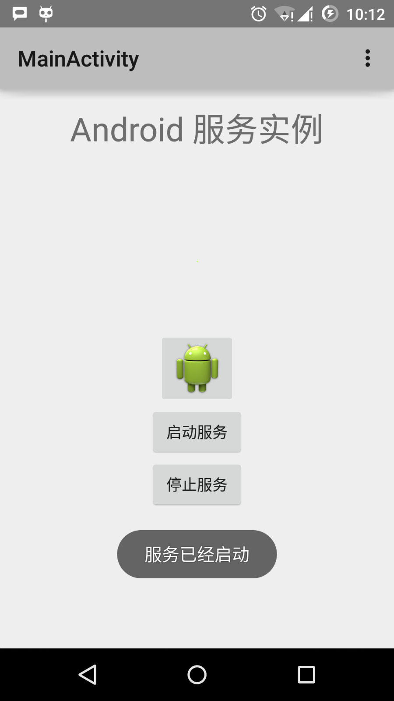

# Android 服务（Service）

- [参考资源](https://www.runoob.com/android/android-services.html)

服务是一个后台运行的组件，执行长时间运行且不需要用户交互的任务。即使应用被销毁也依然可以工作。服务基本上包含两种状态 -

状态	|描述
---|---
`Started`|	Android的应用程序组件，如活动，通过startService()启动了服务，则服务是Started状态。一旦启动，服务可以在后台无限期运行，即使启动它的组件已经被销毁。
`Bound`	|当Android的应用程序组件通过bindService()绑定了服务，则服务是Bound状态。Bound状态的服务提供了一个客户服务器接口来允许组件与服务进行交互，如发送请求，获取结果，甚至通过IPC来进行跨进程通信。

服务拥有生命周期方法，可以实现监控服务状态的变化，可以在合适的阶段执行工作。下面的左图展示了当服务通过startService()被创建时的生命周期，右图则显示了当服务通过bindService()被创建时的生命周期：


要创建服务，你需要创建一个继承自Service基类或者它的已知子类的Java类。Service基类定义了不同的回调方法和多数重要方法。你不需要实现所有的回调方法。虽然如此，理解所有的方法还是非常重要的。实现这些回调能确保你的应用以用户期望的方式实现。

回调	|描述
---|---
`onStartCommand()`	|其他组件(如活动)通过调用startService()来请求启动服务时，系统调用该方法。如果你实现该方法，你有责任在工作完成时通过stopSelf()或者stopService()方法来停止服务。
`onBind`	|当其他组件想要通过bindService()来绑定服务时，系统调用该方法。如果你实现该方法，你需要返回IBinder对象来提供一个接口，以便客户来与服务通信。你必须实现该方法，如果你不允许绑定，则直接返回null。
`onUnbind()`	|当客户中断所有服务发布的特殊接口时，系统调用该方法。
`onRebind()`	|当新的客户端与服务连接，且此前它已经通过onUnbind(Intent)通知断开连接时，系统调用该方法。
`onCreate()`	|当服务通过onStartCommand()和onBind()被第一次创建的时候，系统调用该方法。该调用要求执行一次性安装。
`onDestroy()`	|当服务不再有用或者被销毁时，系统调用该方法。你的服务需要实现该方法来清理任何资源，如线程，已注册的监听器，接收器等。

下面的主服务演示了每个方法的生命周期：

```java
package com.runoob.androidservices;

import android.app.Service;
import android.os.IBinder;
import android.content.Intent;
import android.os.Bundle;

public class HelloService extends Service {

    /** 标识服务如果被杀死之后的行为 */
    int mStartMode;

    /** 绑定的客户端接口 */
    IBinder mBinder;

    /** 标识是否可以使用onRebind */
    boolean mAllowRebind;

    /** 当服务被创建时调用. */
    @Override
    public void onCreate() {

    }

    /** 调用startService()启动服务时回调 */
    @Override
    public int onStartCommand(Intent intent, int flags, int startId) {
        return mStartMode;
    }

    /** 通过bindService()绑定到服务的客户端 */
    @Override
    public IBinder onBind(Intent intent) {
        return mBinder;
    }

    /** 通过unbindService()解除所有客户端绑定时调用 */
    @Override
    public boolean onUnbind(Intent intent) {
        return mAllowRebind;
    }

    /** 通过bindService()将客户端绑定到服务时调用*/
    @Override
    public void onRebind(Intent intent) {

    }

    /** 服务不再有用且将要被销毁时调用 */
    @Override
    public void onDestroy() {

    }
}
```

## 实例

这个例子将通过简单地步骤为你展示如何创建自己的Android服务。按照下面的步骤来修改之前在Hello World实例章节中创建的Android应用程序:

1. 使用Android Studio IDE来创建Android应用程序并在com.runoob.androidservices包下命名为androidservices。类似Hello World实例章节。
2. 修改主活动文件MainActivity.java来添加startService()和stopService()方法。
3. 在包com.runoob.androidservices下创建新的Java文件MyService.java。这个文件将实现Android服务相关的方法。
4. 在AndroidManifest.xml文件中使用<service.../>标签来定义服务。应用程序可以有一个或多个服务，没有任何限制。
5. 修改res/layout/activity_main.xml文件中的默认布局，在线性布局中包含两个按钮。
6. 不要对res/values/strings.xml文件中的任何常量进行修改。Android Studio会注意字符串值。
7. 启动Android模拟器来运行应用程序，并验证应用程序所做改变的结果。

下面是主活动文件src/com.runoob.androidservices/MainActivity.java文件所修改的内容。这个文件包含所有基本的生命周期方法。我们添加了startService()和stopService()方法来启动和停止服务。

```java
package com.runoob.androidservices;

import android.app.Activity;
import android.os.Bundle;
import android.view.Menu;


import android.content.Intent;
import android.view.View;

public class MainActivity extends Activity {

    @Override
    public void onCreate(Bundle savedInstanceState) {
        super.onCreate(savedInstanceState);
        setContentView(R.layout.activity_main);
    }

    @Override
    public boolean onCreateOptionsMenu(Menu menu) {
        getMenuInflater().inflate(R.menu.menu_main, menu);
        return true;
    }

    // Method to start the service
    public void startService(View view) {
        startService(new Intent(getBaseContext(), MyService.class));
    }

    // Method to stop the service
    public void stopService(View view) {
        stopService(new Intent(getBaseContext(), MyService.class));
    }
}
```

以下是src/com.runoob.androidservices/MyService.java的内容。这个文件可以基于需求实现一个或多个服务关联的方法。对于新人，我们只实现onStartCommand()和onDestroy() -

```java
package com.runoob.androidservices;

import android.app.Service;
import android.content.Intent;
import android.os.IBinder;
import android.widget.Toast;

public class MyService extends Service {

    @Override
    public IBinder onBind(Intent arg0) {
        return null;
    }

    @Override
    public int onStartCommand(Intent intent, int flags, int startId) {
        // Let it continue running until it is stopped.
        Toast.makeText(this, "服务已经启动", Toast.LENGTH_LONG).show();
        return START_STICKY;
    }

    @Override
    public void onDestroy() {
        super.onDestroy();
        Toast.makeText(this, "服务已经停止", Toast.LENGTH_LONG).show();
    }
}
```

下面将修改AndroidManifest.xml文件。这里添加<service.../>标签来包含我们的服务：

```xml
<?xml version="1.0" encoding="utf-8"?>
<manifest xmlns:android="http://schemas.android.com/apk/res/android"
    package="com.runoob.androidservices"
    android:versionCode="1"
    android:versionName="1.0">

    <uses-sdk
        android:minSdkVersion="13"
        android:targetSdkVersion="22" />

    <application
        android:icon="@drawable/ic_launcher"
        android:label="@string/app_name"
        android:theme="@style/AppTheme" >

        <activity
            android:name=".MainActivity"
            android:label="@string/title_activity_main" >

            <intent-filter>
                <action android:name="android.intent.action.MAIN" />
                <category android:name="android.intent.category.LAUNCHER"/>
            </intent-filter>

        </activity>

        <service android:name=".MyService" />

    </application>

</manifest>
```

以下是res/layout/activity_main.xml文件的内容，包含两个按钮：

```xml
<RelativeLayout xmlns:android="http://schemas.android.com/apk/res/android"
    xmlns:tools="http://schemas.android.com/tools" android:layout_width="match_parent"
    android:layout_height="match_parent" android:paddingLeft="@dimen/activity_horizontal_margin"
    android:paddingRight="@dimen/activity_horizontal_margin"
    android:paddingTop="@dimen/activity_vertical_margin"
    android:paddingBottom="@dimen/activity_vertical_margin" tools:context=".MainActivity">

    <TextView
        android:id="@+id/textView1"
        android:layout_width="wrap_content"
        android:layout_height="wrap_content"
        android:text="Android 服务实例"
        android:layout_alignParentTop="true"
        android:layout_centerHorizontal="true"
        android:textSize="30dp" />

    <TextView
        android:id="@+id/textView2"
        android:layout_width="wrap_content"
        android:layout_height="wrap_content"
        android:text="www.runoob.com"
        android:textColor="#ff87ff09"
        android:textSize="30dp"
        android:layout_above="@+id/imageButton"
        android:layout_centerHorizontal="true"
        android:layout_marginBottom="40dp" />

    <ImageButton
        android:layout_width="wrap_content"
        android:layout_height="wrap_content"
        android:id="@+id/imageButton"
        android:src="@drawable/ic_launcher"
        android:layout_centerVertical="true"
        android:layout_centerHorizontal="true" />

    <Button
        android:layout_width="wrap_content"
        android:layout_height="wrap_content"
        android:id="@+id/button2"
        android:text="启动服务"
        android:onClick="startService"
        android:layout_below="@+id/imageButton"
        android:layout_centerHorizontal="true" />

    <Button
        android:layout_width="wrap_content"
        android:layout_height="wrap_content"
        android:text="停止服务"
        android:id="@+id/button"
        android:onClick="stopService"
        android:layout_below="@+id/button2"
        android:layout_alignLeft="@+id/button2"
        android:layout_alignStart="@+id/button2"
        android:layout_alignRight="@+id/button2"
        android:layout_alignEnd="@+id/button2" />

</RelativeLayout>
```

下面是res/values/strings.xml的内容，来定义两个新的常量：

```xml
<?xml version="1.0" encoding="utf-8"?>
<resources>

    <string name="app_name">Android Services</string>
    <string name="title_activity_main">MainActivity</string>
    <string name="menu_settings">Settings</string>
    <string name="action_settings">Settings</string>

</resources>
```

让我们运行刚刚修改的My Application应用程序。我假设你已经在安装环境时创建了AVD。打开你的项目中的活动文件，点击工具栏中的图片图标来在Android Studio中运行应用程序。Android Studio在AVD上安装应用程序并启动它。如果一切顺利，将在模拟器窗口上显示如下：



现在点击"启动服务"按钮来启动服务，这将执行我们编写的onStartCommand()方法，一条"服务已经启动"的消息在模拟器的底部出现，如下：


点击底部的"停止服务"按钮，可以停止服务。