# mermaid绘图


## 绘图
### 基于Mermaid的API
需要在每段代码前后添加 \`\`\`mermaid 与 \`\`\`。

例如：

\`\`\`mermaid

graph LR;

A-->B;

B-->C;

\`\`\`

经Markdown解析后显示为：

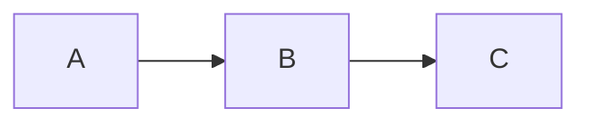

### 流程图
#### 声明部分
```
graph <?>
TB - top bottom
BT - bottom top
RL - right left
LR - left right
TD - same as TB
```
#### 节点内容与形状

- **默认节点**
    ```
    graph LR
    id
    ```

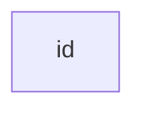

- **方形框节点**
    
    ```
    graph LR
    id1[This is the text in the box]
    ```
    


- **圆弧框节点**
    ```
    graph LR
    id1(This is the text in the box)
    ```
    
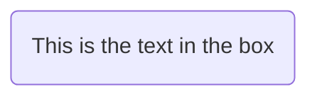

- **圆形框节点**
    ```
    graph LR
    id1((This is the text in the circle))
    ```
    
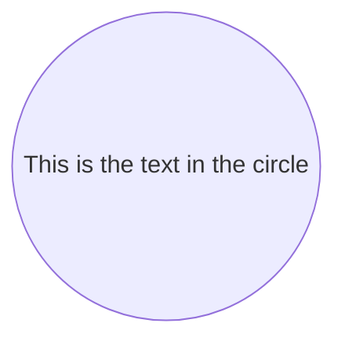

- **旗形节点**
    ```
    graph LR
    id1>This is the text in the box]
    ```
    
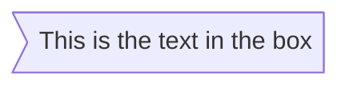

- **菱形节点**
    ```
    graph LR
    id1{This is the text in the box}
    ```
    
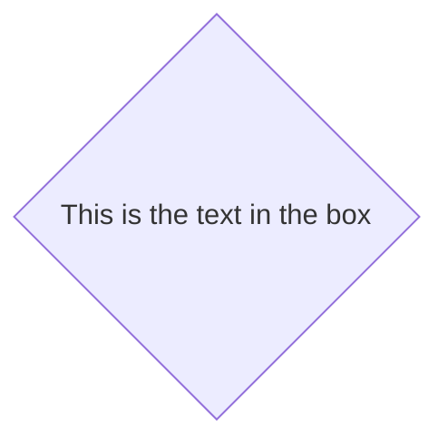

#### 连接线

- **实线箭头**
    ```
    graph LR
    A --> B
    ```
    


- **无箭头实线**
    ```
    graph LR
    A --- B
    ```
    
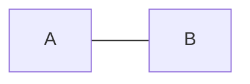

- **带标签无箭头实线**
    ```
    graph LR
    A -- This is the text --- B
    ```
    或者：
    ```
    graph LR
    A --- |This is the text|B
    ```

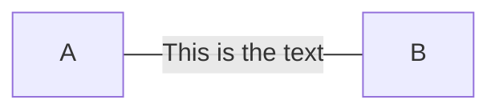

- **带标签有箭头实线**
    ```
    graph LR
    A -- text --> B
    ```
    或者：
    ```
    graph LR
    A -->|text|B
    ```
    
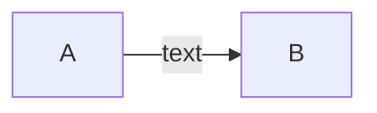

- **虚线连接**
    ```
    graph LR;
    A-.->B;
    ```
    
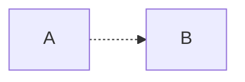

- **粗线连接**
    ```
    graph LR
    A ==> B
    ```
    
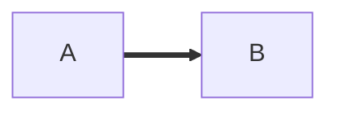

- **（不）带箭头+（不）带标签+粗线/虚线连接**

    参考上文。例如：
    ```
    graph LR
    A ==> |text|B
    ```
    
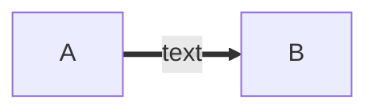

#### 转义字符
- **双引号**
    ```
    graph LR
    id1["This is the (text) in the box"]
    ```
    


- **实体代码转义字符**
    ```
    graph LR
    A["A double quote:#quot;"] -->B["A dec char:#9829;"]
    ```
    


[查看更多转义字符](http://tool.oschina.net/commons?type=2)

#### 子图
- **基本语法**
    ```
    subgraph title
        graph definition
    end
    ```
    示例：
    ```
    graph TB
        c1-->a2
        subgraph one
        a1-->a2
        end
        subgraph two
        b1-->b2
        end
        subgraph three
        c1-->c2
        end
    ```

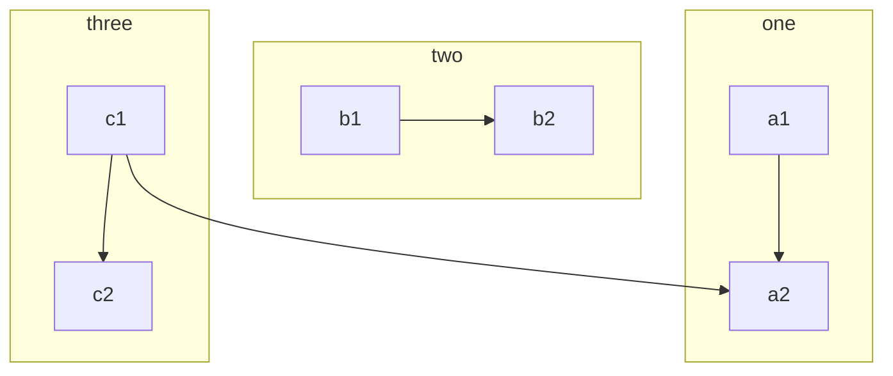

#### JavaScript拓展
- **打开新链接**

    语法：`click nodeId callback`

    ```
    graph LR;
        A-->B[Github];
        click A callback "Tooltip"
        click B "http://www.github.com" "This is a link"
    ```

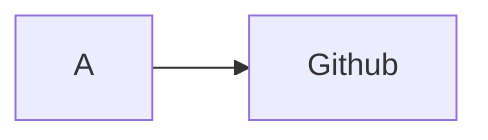

*注：工具提示文本用双引号括起来。工具提示的样式由类.mermaidTooltip设置。*

#### 显示样式拓展

- **编辑连接线样式**

    使用 linkStyle 开头，之后数字表示第几根连接线（从0开始），然后加自定义样式代码。如：

    ```
    graph TD
        A-->B
        B-->C
        linkStyle 1 stroke:#ff3,stroke-width:5px;
    ```

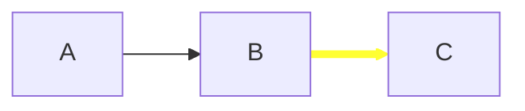

- **编辑节点样式**

    使用 `style+nodeID + 样式描述` 定义节点的样式，如：
    ```
    graph LR
        A(Start)-->B(Stop)
        style A fill:#ff0,stroke:#033,stroke-width:5px
        style B fill:#ccf,stroke:#f66,stroke-width:2px,stroke-dasharray: 5
    ```

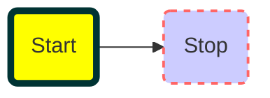


- **使用类进行批量操作**

    类的定义语法示例：
    ```
    classDef className fill:#f9f,stroke:#333,stroke-width:4px;
    ```
    类的使用语法示例：
    ```
    class nodeId1,nodeId2 className;
    ```

    综合示例：
    ```
    graph LR
        classDef style1 fill:#bee,stroke:#440,stroke-width:4px;
        A-->B
        B-->C
        class A,C style1
        linkStyle 1 stroke:#588,stroke-width:3px;
    ```

```mermaid
graph LR
classDef style1 fill:#bee,stroke:#440,stroke-width:4px;
A-->B
B-->C
class A,C style1
linkStyle 1 stroke:#588,stroke-width:3px;
```
    
*注意：如果一个类被命名为default，它将被分配给所有没有特定类定义的类。*

- **在CSS中预定义**

    示例样式：
    ```
    <style>
        .cssClass > rect{
            fill:#FF0000;
            stroke:#FFFF00;
            stroke-width:4px;
        }
    </style>
    ```
    示例定义：
    ```
    graph LR;
        A-->B[AAA<span>BBB</span>];
        B-->D;
        class A cssClass;
    ```

- **添加icon**

    可以通过语法 `fa：#icon class name＃` 获得 fontawesome 图标。

    更多图标查看：[fontawesome图标](https://fontawesome.com/icons?d=gallery)

    ```
    graph TD
        B[fa:fa-comment iconTest]
        B-->C[fa:fa-wechat Wechat]
        B-->D(fa:fa-qq QQ);
        B-->E(fa:fa-github GitHub);
    ```

```mermaid
graph TD
    B[fa:fa-comment iconTest]
    B-->C[fa:fa-wechat Wechat]
    B-->D(fa:fa-qq QQ);
    B-->E(fa:fa-github GitHub);
```

*注：这需要markdown编辑器支持fontawesome图标*

### 时序图
#### 语法声明
使用"sequenceDiagram"声明时序图

#### 别名
使用 ` participant ID as Name ` 语法：

```
sequenceDiagram
    participant A as Alice
    participant J as John
    A--xJ: Hello John, how are you?
    J->>A: Great!
```

```mermaid
sequenceDiagram
    participant A as Alice
    participant J as John
    A--xJ: Hello John, how are you?
    J->>A: Great!
```

#### 消息格式

`[Actor][Arrow][Actor]:Message text`

类型|描述
--|--
->|没有箭头的实线
-->|没有箭头的虚线
->>|带箭头的实线
-->>|带箭头的虚线
-X|最后带十字的实线（异步）
--X|最后用十字线的虚线（异步）


#### 激活状态
使用 `activate actor` 与 `deactivate actor` 标签对，或者使用 “+/-” ：

```
sequenceDiagram
    Alice->>John: Hello John, how are you?
    activate John
    John-->>Alice: Great!
    deactivate John
```
或：
```
sequenceDiagram
    Alice->>+John: Hello John, how are you?
    John-->>-Alice: Great!
```

```mermaid
sequenceDiagram
    Alice->>John: Hello John, how are you?
    activate John
    John-->>Alice: Great!
    deactivate John
```

*注：激活状态可以进行嵌套*

#### 添加标签

语法：`Note [ right of | left of | over ] [Actor]
` 

Note 可以覆盖多个 Actor ：

```
sequenceDiagram
    Alice->John: Hello John, how are you?
    Note over Alice,John: A typical interaction
```

```mermaid
sequenceDiagram
    Alice->John: Hello John, how are you?
    Note over Alice,John: A typical interaction
```

#### 循环

语法格式：

```
loop[Loop text]
... statements ...
end
```

使用示例：
```
sequenceDiagram
    Alice->>John: Hello John, how are you?
    loop Every minute
        John-->>Alice: Great!
    end
```

```mermaid
sequenceDiagram
    Alice->>John: Hello John, how are you?
    loop Every minute
        John-->>Alice: Great!
    end
```

#### 选择

```
alt[Describing text]
... statements ...
else
... statements ...
end

或：

opt[Describing text]
... statements ...
end
```

示例：
```
sequenceDiagram
    Alice->>Bob: Hello Bob, how are you?
    alt is sick
        Bob->>Alice: Not so good :(
    else is well
        Bob->>Alice: Feeling fresh like a daisy
    end
    opt Extra response
        Bob->>Alice: Thanks for asking
    end
```

```mermaid
sequenceDiagram
    Alice->>Bob: Hello Bob, how are you?
    alt is sick
        Bob->>Alice: Not so good :(
    else is well
        Bob->>Alice: Feeling fresh like a daisy
    end
    opt Extra response
        Bob->>Alice: Thanks for asking
    end
```

#### 样式美化
参考链接：[mermaid sequenceDiagram](https://mermaidjs.github.io/sequenceDiagram.html)

### 甘特图

甘特图一般用于描绘项目的终端元素和摘要元素的开始和结束日期。

示例：
```
gantt
       dateFormat  YYYY-MM-DD
       title Adding GANTT diagram functionality to mermaid
	   
       section A section
       Completed task            :done,    des1, 2014-01-06,2014-01-08
       Active task               :active,  des2, 2014-01-09, 3d
       Future task               :         des3, after des2, 5d
       Future task2              :         des4, after des3, 5d
	   
       section Critical tasks
       Completed task in the critical line :crit, done, 2014-01-06,24h
       Implement parser and jison          :crit, done, after des1, 2d
       Create tests for parser             :crit, active, 3d
       Future task in critical line        :crit, 5d
       Create tests for renderer           :2d
       Add to mermaid                      :1d
	   
       section Documentation
       Describe gantt syntax               :active, a1, after des1, 3d
       Add gantt diagram to demo page      :after a1  , 20h
       Add another diagram to demo page    :doc1, after a1  , 48h
	   
       section Last section
       Describe gantt syntax               :after doc1, 3d
       Add gantt diagram to demo page      :20h
       Add another diagram to demo page    :48h
```

```mermaid
gantt
       dateFormat  YYYY-MM-DD
       title Adding GANTT diagram functionality to mermaid
	   
       section A section
       Completed task            :done,    des1, 2014-01-06,2014-01-08
       Active task               :active,  des2, 2014-01-09, 3d
       Future task               :         des3, after des2, 5d
       Future task2              :         des4, after des3, 5d
	   
       section Critical tasks
       Completed task in the critical line :crit, done, 2014-01-06,24h
       Implement parser and jison          :crit, done, after des1, 2d
       Create tests for parser             :crit, active, 3d
       Future task in critical line        :crit, 5d
       Create tests for renderer           :2d
       Add to mermaid                      :1d
	   
       section Documentation
       Describe gantt syntax               :active, a1, after des1, 3d
       Add gantt diagram to demo page      :after a1  , 20h
       Add another diagram to demo page    :doc1, after a1  , 48h
	   
       section Last section
       Describe gantt syntax               :after doc1, 3d
       Add gantt diagram to demo page      :20h
       Add another diagram to demo page    :48h
```

绘制甘特图参考：[mermaid gantt](https://mermaidjs.github.io/gantt.html)
