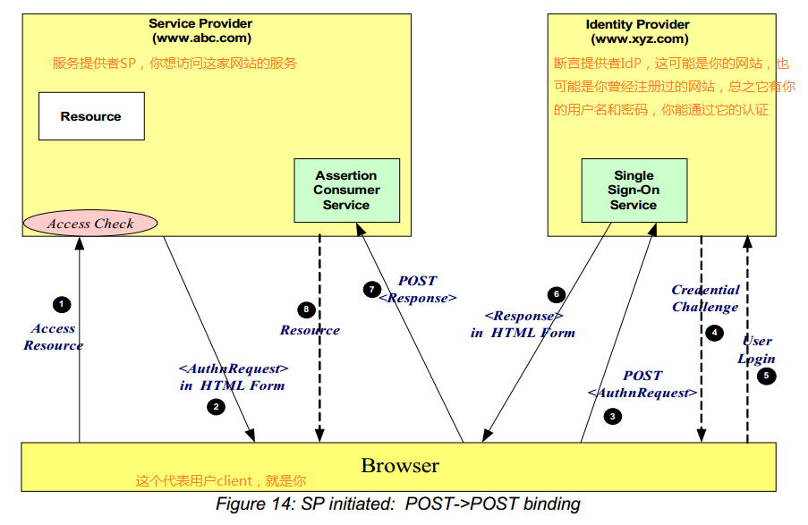
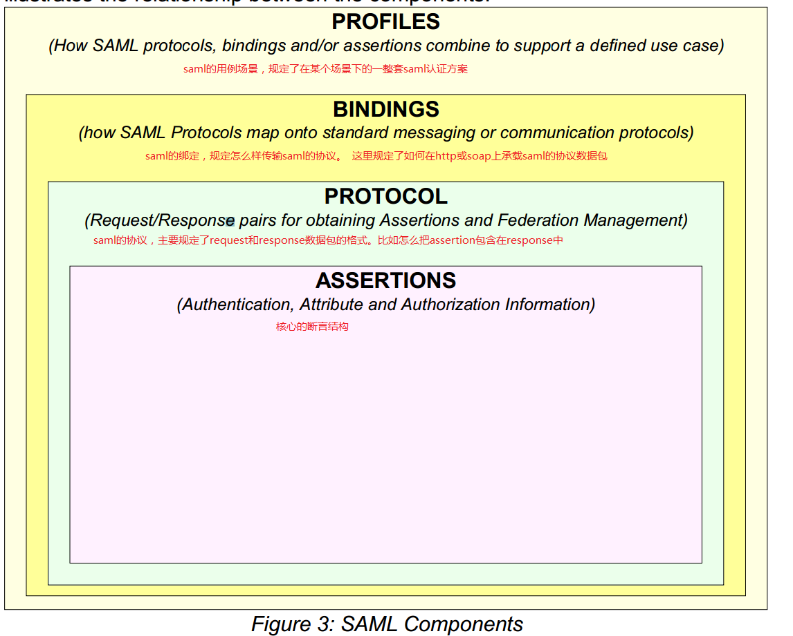

# 我眼中的SAML

来源：[我眼中的SAML (Security Assertion Markup Language) - -Neil - 博客园](https://www.cnblogs.com/shuidao/p/3463947.html)

## Saml是什么

首先，saml是一种xml格式的语言。 翻译过来大概叫 安全断言（标记）语言。  这里有两个点： 第一是“安全”， 第二是“断言(assertion)”。  用人话翻译saml就是 用安全的方式表达断言一种语言。

先看它的核心概念“断言”。  断言是什么？  就是做出判断的语言。比如一句话： 小明是超级管理员。 这就是一个断言。再来一个例子：小红没有权限读取根目录。这也是一个断言。  这种“做出判断的语句”我们在很多场合都需要用到。  比如你在网上尝试登陆一个服务的时候， 这个服务需要知道你是不是合法的用户。 这个时候如果你能提供一个“安全，可靠，可信任”的断言：“小明有权登陆XX服务”， 那么这个服务就知道你合法了， 于是就能为你提供服务了。  这个例子比较抽象，但基本上能表达断言在实际用例中的作用了。 实际上saml的大部分用例就在于证明你是谁，你拥有什么权限等等了。 saml中大部分主要内容也都是类似于：你是谁， 你有什么。。等等这些简单的语句。 详细内容后面会介绍。

接下来第二个概念就是“安全”了。  你能提供一个断言， 别人能不能假冒你提供一个断言从而骗取服务端的信任呢？ 另外服务端为什么会信任你给的断言呢？ 这就涉及到安全的问题了。为了防止断言被假冒，篡改。saml中加入了安全措施。 当然现今能抵御假冒，篡改，重放攻击的利器就是公钥-私钥系统了。  通过给断言加上签名和加密，再结合数字证书系统就确保了saml不受攻击。

在很多sso的场合中， 都支持saml登陆。 这就是saml最多的一个应用场景。  作用相当于大家熟知的OpenID，和Oauth等等。
好了，说完了大体的概念，就来程序员最喜欢的硬菜了。  

## 从技术的角度看saml

saml迄今为止有两个广泛应用的标准， Saml 1.1 和Saml 2.0
为了尝鲜，大家先看两个saml的例子， 看个样子即可，不用阅读内容，给你1分钟， 看完赶紧回来接着看这里哦：

[http://en.wikipedia.org/wiki/SAML_1.1](http://en.wikipedia.org/wiki/SAML_1.1)

[http://en.wikipedia.org/wiki/SAML_2.0](http://en.wikipedia.org/wiki/SAML_2.0)

恩，很好， 你已经知道saml大概长什么样了。   saml1.1和saml2.0 是同一个标准的两个版本， 他们在逻辑概念或者对象结构上大致相当， 只是在一些细节上有所差异。 这两个版本不兼容。 另外1.1比2.0要简单许多。  所以下面在讲逻辑结构的时候一般不区分这两个版本，除非特别说明的地方。
我猜你一定喜欢下面这种图：



>这张图取自：[https://www.oasis-open.org/committees/download.php/11511/sstc-saml-tech-overview-2.0-draft-03.pdf](https://www.oasis-open.org/committees/download.php/11511/sstc-saml-tech-overview-2.0-draft-03.pdf)

这是saml2.0的一个极其简单的应用场景.  如果你不嫌烦的话，我来解释一下这个图：

图上共有三个角色， 1，SP， 服务提供者。 2， Idp，认证用户并生成断言。 3，就是用户你了， client。

首先， 你（client）是idp的注册用户， 它有你的用户名和密码，它可以认证你就是你。 其次， SP和Idp两者会被各自的域管理员设置为相互信任对方。并且双方都持有对方的公钥。这是配置好的。第三，有一天，你需要访问sp提供的某个服务，但是sp并不认识你，也没有你的用户名和密码因此不能认证你。 

于是就发生了上图所示的8个步骤：

1. 你去访问sp的某个受保护资源，比如浏览器打开： [http://www.apc.com/resource1.aspx.](http://www.apc.com/resource1.aspx.)
2. sp发现你是新来的，没有认证信息。当然不能给你这个页面内容了。 他就会生成一个 saml的认证请求数据包（当然是saml格式的）。把这个请求放在一个html的form的一个隐藏的域中，把这个html form返回给你。 这个form后面有一句javascript自动提交这个form。 二而form的action地址就是 提前配置好的 idp上的一个地址。

    ```xml
    saml认证请求的数据包可能是这个样子的：
    ==========
    <samlp:AuthnRequest
    xmlns:samlp="urn:oasis:names:tc:SAML:2.0:protocol"
    xmlns:saml="urn:oasis:names:tc:SAML:2.0:assertion"
    ID="aaf23196-1773-2113-474a-fe114412ab72"
    Version="2.0"
    IssueInstant="2004-12-05T09:21:59"
    AssertionConsumerServiceIndex="0"
    AttributeConsumingServiceIndex="0">
    <saml:Issuer>https://sp.example.com/SAML2</saml:Issuer>
    <samlp:NameIDPolicy
    AllowCreate="true"
    Format="urn:oasis:names:tc:SAML:2.0:nameid-format:transient"/>
    </samlp:AuthnRequest>
    ==========
    而返回的html from内容大概设这个样子的：它包含了上面的数据包作为其中一个hidden的值。
    =============================
    <form method="post" action="https://idp.example.org/SAML2/SSO/POST" ...>
    <input type="hidden" name="SAMLRequest" value="<samlp:AuthnRequest>.......... </samlp:authnreques>" />
    ... other input parameter....
    <input type="submit" value="Submit" />

    </form>

    <javascript>
    document.form[0].submit();// 后面紧跟一句类似这样的提交代码.
    </javascript>
    =============================
    这些代码一部分是复制过来的， 有些是我现写的， 大家领会意思即可，不要在意那些细节。
    ```

3. 上面的form会被javascript自动提交到idp的某个地址。
4. idp也需要认证你， 于是返回给你一个认证的页面， 可能使用用户名密码认证，也可以使用ntlm认证等等一切可以认证你的方式。 因为idp保存有你的用户名和密码。
5. 同上一步，也是认证你的一个过程。
6. idp在认证你之后。觉得你合法， 于是就为你生成一些断言， 证明你是谁，你有什么权限等等。 并用自己的私钥签名。 然后包装成一个response格式，放在form里返回给你。

   ```xml
   断言的格式大概如下：
   =============
   <saml:Assertion
   xmlns:saml="urn:oasis:names:tc:SAML:2.0:assertion"
   xmlns:xs="http://www.w3.org/2001/XMLSchema"
   xmlns:xsi="http://www.w3.org/2001/XMLSchema-instance"
   ID="b07b804c-7c29-ea16-7300-4f3d6f7928ac"
   Version="2.0"
   IssueInstant="2004-12-05T09:22:05">
   <saml:Issuer>https://idp.example.org/SAML2</saml:Issuer>
   <ds:Signature
   xmlns:ds="http://www.w3.org/2000/09/xmldsig#">...</ds:Signature>
   <saml:Subject>
   ..........
   </saml:Subject>
   <saml:Conditions
   .........
   </saml:Conditions>
   <saml:AuthnStatement
   AuthnInstant="2004-12-05T09:22:00"
   SessionIndex="b07b804c-7c29-ea16-7300-4f3d6f7928ac">
   <saml:AuthnContext>
   <saml:AuthnContextClassRef>
   urn:oasis:names:tc:SAML:2.0:ac:classes:PasswordProtectedTransport
   </saml:AuthnContextClassRef>
   </saml:AuthnContext>
   </saml:AuthnStatement>
   <saml:AttributeStatement>
   <saml:Attribute
   xmlns:x500="urn:oasis:names:tc:SAML:2.0:profiles:attribute:X500"
   x500:Encoding="LDAP"
   NameFormat="urn:oasis:names:tc:SAML:2.0:attrname-format:uri"
   Name="urn:oid:1.3.6.1.4.1.5923.1.1.1.1"
   FriendlyName="eduPersonAffiliation">
   <saml:AttributeValue
   xsi:type="xs:string">member</saml:AttributeValue>
   <saml:AttributeValue
   xsi:type="xs:string">staff</saml:AttributeValue>
   </saml:Attribute>
   </saml:AttributeStatement>
   </saml:Assertion>
   =============
   其中authnstatement认证语句表示你认证成功了。subject表示你是谁。而attributestatement表示你有哪些属性。 还有一个授权语句上面例子中没有。
   Response语句大概如下：
   ============================
   <samlp:Response
   xmlns:samlp="urn:oasis:names:tc:SAML:2.0:protocol"
   xmlns:saml="urn:oasis:names:tc:SAML:2.0:assertion"
   ID="identifier_2"
   InResponseTo="identifier_1"
   Version="2.0"
   IssueInstant="2004-12-05T09:22:05"
   Destination="https://sp.example.com/SAML2/SSO/POST">
   <saml:Issuer>https://idp.example.org/SAML2</saml:Issuer>
   <samlp:Status>
   <samlp:StatusCode
   Value="urn:oasis:names:tc:SAML:2.0:status:Success"/>
   </samlp:Status>
   <saml:Assertion
   xmlns:saml="urn:oasis:names:tc:SAML:2.0:assertion"
   ID="identifier_3"
   Version="2.0"
   IssueInstant="2004-12-05T09:22:05">
   <saml:Issuer>https://idp.example.org/SAML2</saml:Issuer>
   <!-- a POSTed assertion MUST be signed -->
   ....................
   </saml:Assertion>
   </samlp:Response>
   ============================
   正如上面第2步一样，它也会把response包装在一个form里面返回给你，并自动提交给 sp的某个地址。
   ===========
   <form method="post" action="https://sp.example.com/SAML2/SSO/POST" ...>
   <input type="hidden" name="SAMLResponse" value="<samlp:Response>.........</samlp:respons>" />
   <input type="hidden" name="RelayState" value="''token''" />
   ...
   <input type="submit" value="Submit" />
   </form>
   <javascript>
   document.form[0].submit();// 后面紧跟一句类似这样的提交代码.
   </javascript>
   ===========
   ```

7. 于是就到了第7步， 这个form被javascript自动提交到sp了。
8. sp读到form提交上来的 断言。 并通过idp的公钥验证了断言的签名。 于是信任了断言。 知道你是idp的合法用户了。 所以就最终给你返回了你最初请求的页面了。 [http://www.apc.com/resource1.aspx.](http://www.apc.com/resource1.aspx.)

好了一个最简单的saml用例就讲完了。 你可以看到其中几乎所有的步骤都可以自动完成，用户在第一步访问资源之后，就看到浏览器再自动跳转，自己不需要操作什么，几秒钟过后，资源就访问成功了。

到这里， 相信saml在你心目中的形象一定跟家立体了。  如果你还有兴趣就继续往下看吧.

上面是“远观”， 下面我们走近。先看saml标准的结构：



>此图出自：[https://www.oasis-open.org/committees/download.php/11511/sstc-saml-tech-overview-2.0-draft-03.pdf](https://www.oasis-open.org/committees/download.php/11511/sstc-saml-tech-overview-2.0-draft-03.pdf)

saml标准从内到外 可以分为上图的4个层次：

1. Assertion。 断言。 规定了断言的xml结构， 例如：

   ```xml
   ==============
   <saml:Assertion>
   ..............
   </saml:Assertion?
   ==============
   ```

   它规定了，这个assertion节点到底该怎么写， 其实就是这个节点的schema。 按照这个规定写出来的assertion别人才能认识。

2. Protocols。协议。它规定了如何请求（samlrequest）和回复(samlresponse )saml消息，其中当然包含assertion的消息。比如：

   ```xml
   ===============
   <samlp:AuthnRequest>
   ............
   </samlp:AuthnRequest>
   还有：
    <samlp:Response> 
   ..............
   </samlp:Response>
   ===============
   ```

   它规定了怎么发送这些请求消息，和回复消息的结构。 这样sp，idp之间才能通信。

3. 绑定。  上面两点都是规定了静态结构。 具体这些消息怎么发送呢。 就是用什么协议来承载这些smal消息呢。就是绑定出马了。 最常用的就是http或者soap消息。  把上面的saml消息通过http或者soap消息来传输。 这样sp和idp就能通信了。  saml1.1只支持 http的soap绑定。 而saml2.0支持更多的绑定。 有兴趣自己阅读标准。   这里需要强调的是， 你可能已经想到了，那就是这个绑定其实不重要。 只要saml消息本身是完整的可靠的，下层用什么协议传输不重要。  对。 saml标准规定的绑定只是一种标准实现。  saml的消息可以绑定到任何协议上， 只要sp和idp实现协商好就行了。  这里面应用最广泛的恐怕要算saml的wss绑定了。 用在微软的一系列产品里面。 包括sharepoint online的登陆授权， windows azure登陆，以及windows store的登陆授权等等。  微软自己在ws-trust和ws-secure协议上传输了saml消息。  这恐怕是saml标准以外用的最多的绑定了。
4. Profile， 这个单词我实在不知道翻译成啥好，所以就写原文把。 我个人喜欢把它叫做一套配置，或者叫解决方案。 它规定了某些场景下一整套saml认证的细节和步骤。 比如， 它规定了比较著名的SSO方案。 就是如何用saml实现sso的一整套配置和详细步骤。  概念就是这样。  同上， 上面的绑定都不确定，所以这个profile就更自由了。 你可以使用任何自己定义的profile，只要你们自己协商好就行了。

恩好吧， 先到这吧。大体结构已经出来了。 后续我可能会再分享一下有趣或者有坑的地方。 欢迎大家访问我的个人独立博客交流学习： [http://byNeil.com](http://byNeil.com)

附上saml协议标准地址：

- [https://www.oasis-open.org/committees/download.php/3406/oasis-sstc-saml-core-1.1.pdf](https://www.oasis-open.org/committees/download.php/3406/oasis-sstc-saml-core-1.1.pdf)
- [http://docs.oasis-open.org/security/saml/v2.0/saml-core-2.0-os.pdf](http://docs.oasis-open.org/security/saml/v2.0/saml-core-2.0-os.pdf)
